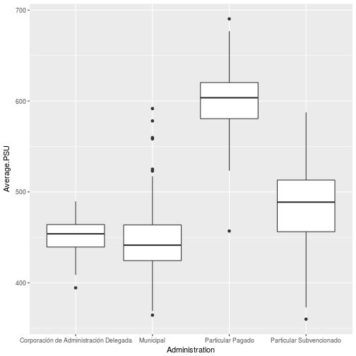
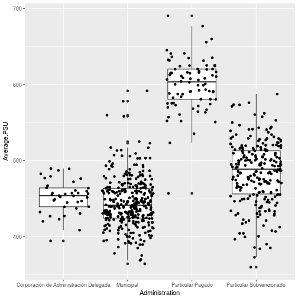
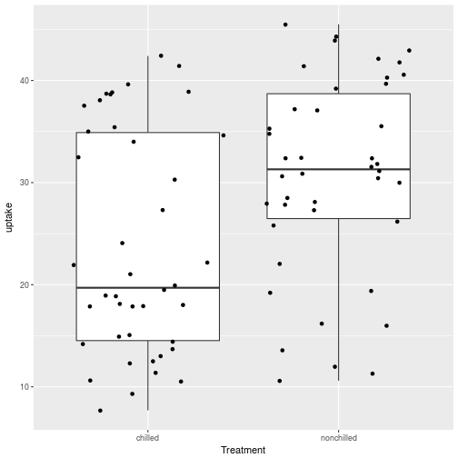
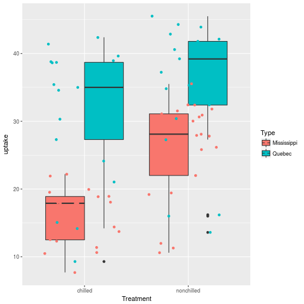
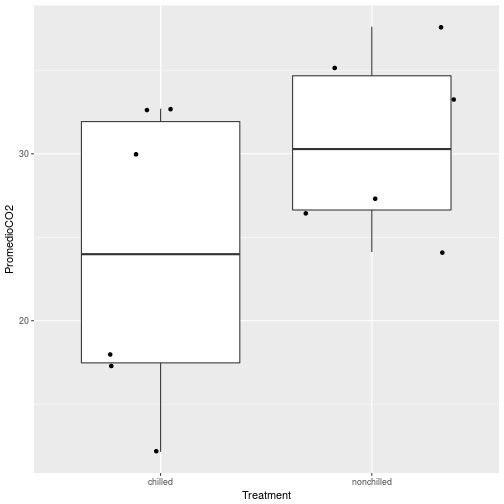
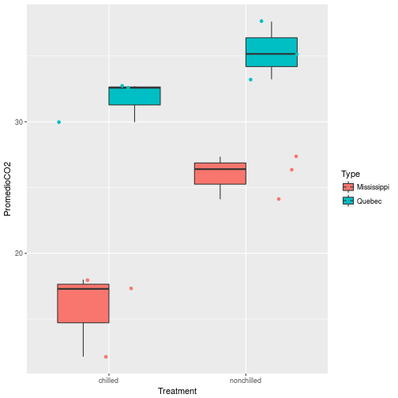

<style>
.reveal h1, .reveal h2, .reveal h3 {
  word-wrap: normal;
  -moz-hyphens: none;
}
</style>

<style>
.small-code pre code {
  font-size: 1em;
}
</style>

Práctico 2 Análisis exploratorio y el primer anova
========================================================
author: Derek Corcoran
date: "14/03, 2018"
autosize: true
transition: rotate

Actividad 1 Educación en Chile
========================================================
incremental: true


* Pueden encontrar la base de datos original en [Data Chile](https://es.datachile.io/geo/chile#education)
* Trataremos de determinar si existen brechas en la Eduacación Chilena por tipo de institución
* Para ello, primero trabajaremos realizando análisis exploratorios
  + Gráficos
  * Tablas resumen
* En la próxima tabla veremos la versión cruda de los datos
* Lo primero que deben hacer es generar una tabla resumen usando el tidyverse (group_by, summarize)
* Recuerden: **mean()** promedio; **sd()** desviacion estándar, **n()** número de muestras

Educación en Chile
========================================================


| ID.Region|Region                        | ID.Comuna|Comuna                    | ID.Administration|Administration                         | Average.PSU| Average.NEM| Number.of.records|
|---------:|:-----------------------------|---------:|:-------------------------|-----------------:|:--------------------------------------|-----------:|-----------:|-----------------:|
|         1|Tarapacá                      |         5|Alto Hospicio             |                 1|Municipal                              |      459.80|        5.55|                76|
|         1|Tarapacá                      |         5|Alto Hospicio             |                 2|Particular Subvencionado               |      455.55|        5.55|              1289|
|         1|Tarapacá                      |        58|Colchane                  |                 1|Municipal                              |      370.17|        5.49|                 3|
|         1|Tarapacá                      |       108|Huara                     |                 1|Municipal                              |      378.23|        5.62|                15|
|         1|Tarapacá                      |       113|Iquique                   |                 1|Municipal                              |      445.32|        5.56|               877|
|         1|Tarapacá                      |       113|Iquique                   |                 2|Particular Subvencionado               |      514.79|        5.68|              2568|
|         1|Tarapacá                      |       113|Iquique                   |                 3|Particular Pagado                      |      580.56|        5.99|               125|
|         1|Tarapacá                      |       113|Iquique                   |                 4|Corporación de Administración Delegada |      432.49|        5.37|                75|
|         1|Tarapacá                      |       217|Pica                      |                 1|Municipal                              |      443.55|        5.66|                24|
|         1|Tarapacá                      |       226|Pozo Almonte              |                 1|Municipal                              |      410.49|        5.62|               211|
|         1|Tarapacá                      |       226|Pozo Almonte              |                 2|Particular Subvencionado               |      373.00|        4.90|                 1|
|         2|Antofagasta                   |         9|Antofagasta               |                 1|Municipal                              |      446.05|        5.58|              2365|
|         2|Antofagasta                   |         9|Antofagasta               |                 2|Particular Subvencionado               |      520.52|        5.61|              2220|
|         2|Antofagasta                   |         9|Antofagasta               |                 3|Particular Pagado                      |      560.57|        5.72|               972|
|         2|Antofagasta                   |        19|Calama                    |                 1|Municipal                              |      471.04|        5.44|              1734|
|         2|Antofagasta                   |        19|Calama                    |                 2|Particular Subvencionado               |      523.33|        5.62|               746|
|         2|Antofagasta                   |        19|Calama                    |                 3|Particular Pagado                      |      550.82|        5.75|               484|
|         2|Antofagasta                   |       165|María Elena               |                 1|Municipal                              |      457.38|        5.89|                64|
|         2|Antofagasta                   |       170|Mejillones                |                 1|Municipal                              |      427.72|        5.87|                95|
|         2|Antofagasta                   |       297|San Pedro De Atacama      |                 1|Municipal                              |      460.67|        5.57|                32|
|         2|Antofagasta                   |       313|Taltal                    |                 1|Municipal                              |      440.32|        5.98|               155|
|         2|Antofagasta                   |       321|Tocopilla                 |                 1|Municipal                              |      392.14|        5.48|               167|
|         2|Antofagasta                   |       321|Tocopilla                 |                 2|Particular Subvencionado               |      508.28|        5.65|               105|
|         3|Atacama                       |         4|Alto Del Carmen           |                 1|Municipal                              |      447.98|        5.58|                23|
|         3|Atacama                       |        21|Caldera                   |                 1|Municipal                              |      400.19|        5.37|                71|
|         3|Atacama                       |        21|Caldera                   |                 2|Particular Subvencionado               |      474.61|        5.55|               110|
|         3|Atacama                       |        39|Chañaral                  |                 1|Municipal                              |      455.20|        5.79|               127|
|         3|Atacama                       |        39|Chañaral                  |                 2|Particular Subvencionado               |      449.43|        5.81|                18|
|         3|Atacama                       |        68|Copiapó                   |                 1|Municipal                              |      449.29|        5.38|               986|
|         3|Atacama                       |        68|Copiapó                   |                 2|Particular Subvencionado               |      519.58|        5.52|              1296|
|         3|Atacama                       |        68|Copiapó                   |                 3|Particular Pagado                      |      619.94|        6.02|               159|
|         3|Atacama                       |        81|Diego De Almagro          |                 1|Municipal                              |      475.68|        5.79|               108|
|         3|Atacama                       |        81|Diego De Almagro          |                 2|Particular Subvencionado               |      497.55|        5.73|               142|
|         3|Atacama                       |        93|Freirina                  |                 1|Municipal                              |      434.69|        5.84|                32|
|         3|Atacama                       |       109|Huasco                    |                 1|Municipal                              |      429.34|        5.78|                82|
|         3|Atacama                       |       317|Tierra Amarilla           |                 1|Municipal                              |      401.35|        5.55|               135|
|         3|Atacama                       |       330|Vallenar                  |                 1|Municipal                              |      429.98|        5.61|               567|
|         3|Atacama                       |       330|Vallenar                  |                 2|Particular Subvencionado               |      541.35|        5.80|               261|
|         3|Atacama                       |       330|Vallenar                  |                 3|Particular Pagado                      |      634.89|        6.22|                35|
|         4|Coquimbo                      |         7|Andacollo                 |                 1|Municipal                              |      442.38|        5.50|                64|
|         4|Coquimbo                      |         7|Andacollo                 |                 2|Particular Subvencionado               |      461.12|        5.64|                38|
|         4|Coquimbo                      |        27|Canela                    |                 1|Municipal                              |      433.27|        5.97|                51|
|         4|Coquimbo                      |        62|Combarbalá                |                 1|Municipal                              |      446.02|        5.65|               139|
|         4|Coquimbo                      |        62|Combarbalá                |                 2|Particular Subvencionado               |      445.15|        5.83|                26|
|         4|Coquimbo                      |        69|Coquimbo                  |                 1|Municipal                              |      457.11|        5.48|               937|
|         4|Coquimbo                      |        69|Coquimbo                  |                 2|Particular Subvencionado               |      489.82|        5.55|              2260|
|         4|Coquimbo                      |       111|Illapel                   |                 1|Municipal                              |      433.04|        5.56|               318|
|         4|Coquimbo                      |       111|Illapel                   |                 2|Particular Subvencionado               |      509.86|        5.70|               196|
|         4|Coquimbo                      |       122|La Higuera                |                 1|Municipal                              |      364.50|        5.50|                 1|
|         4|Coquimbo                      |       126|La Serena                 |                 1|Municipal                              |      449.80|        5.52|               940|
|         4|Coquimbo                      |       126|La Serena                 |                 2|Particular Subvencionado               |      522.85|        5.60|              3404|
|         4|Coquimbo                      |       126|La Serena                 |                 3|Particular Pagado                      |      590.34|        5.87|               485|
|         4|Coquimbo                      |       156|Los Vilos                 |                 1|Municipal                              |      439.31|        5.69|               145|
|         4|Coquimbo                      |       156|Los Vilos                 |                 2|Particular Subvencionado               |      480.77|        5.68|               128|
|         4|Coquimbo                      |       174|Monte Patria              |                 1|Municipal                              |      445.01|        5.61|               121|
|         4|Coquimbo                      |       174|Monte Patria              |                 2|Particular Subvencionado               |      470.69|        5.45|                51|
|         4|Coquimbo                      |       192|Ovalle                    |                 1|Municipal                              |      459.65|        5.58|               863|
|         4|Coquimbo                      |       192|Ovalle                    |                 2|Particular Subvencionado               |      516.91|        5.64|              1088|
|         4|Coquimbo                      |       192|Ovalle                    |                 3|Particular Pagado                      |      645.18|        6.01|                47|
|         4|Coquimbo                      |       192|Ovalle                    |                 4|Corporación de Administración Delegada |      427.07|        5.20|                63|
|         4|Coquimbo                      |       195|Paihuano                  |                 1|Municipal                              |      414.72|        5.46|                27|
|         4|Coquimbo                      |       237|Punitaqui                 |                 1|Municipal                              |      405.00|        5.41|                58|
|         4|Coquimbo                      |       237|Punitaqui                 |                 2|Particular Subvencionado               |      507.33|        5.43|                19|
|         4|Coquimbo                      |       271|Rio Hurtado               |                 1|Municipal                              |      403.21|        5.45|                47|
|         4|Coquimbo                      |       278|Salamanca                 |                 1|Municipal                              |      445.20|        5.65|                78|
|         4|Coquimbo                      |       278|Salamanca                 |                 2|Particular Subvencionado               |      480.36|        5.71|               263|
|         4|Coquimbo                      |       334|Vicuña                    |                 1|Municipal                              |      418.56|        5.46|               107|
|         4|Coquimbo                      |       334|Vicuña                    |                 2|Particular Subvencionado               |      468.54|        5.76|               249|
|         5|Valparaíso                    |         1|Algarrobo                 |                 1|Municipal                              |      434.84|        5.51|                99|
|         5|Valparaíso                    |         1|Algarrobo                 |                 2|Particular Subvencionado               |      503.18|        5.65|                75|
|         5|Valparaíso                    |        16|Cabildo                   |                 1|Municipal                              |      431.09|        5.56|               283|
|         5|Valparaíso                    |        16|Cabildo                   |                 2|Particular Subvencionado               |      544.26|        5.73|               118|
|         5|Valparaíso                    |        22|Calera                    |                 1|Municipal                              |      395.52|        5.28|               140|
|         5|Valparaíso                    |        22|Calera                    |                 2|Particular Subvencionado               |      514.44|        5.69|               530|
|         5|Valparaíso                    |        22|Calera                    |                 3|Particular Pagado                      |      552.01|        6.17|                65|
|         5|Valparaíso                    |        22|Calera                    |                 4|Corporación de Administración Delegada |      451.65|        5.28|               136|
|         5|Valparaíso                    |        24|Calle Larga               |                 1|Municipal                              |      401.89|        5.03|                41|
|         5|Valparaíso                    |        24|Calle Larga               |                 2|Particular Subvencionado               |      455.07|        5.47|                51|
|         5|Valparaíso                    |        24|Calle Larga               |                 3|Particular Pagado                      |      588.32|        6.04|                22|
|         5|Valparaíso                    |        30|Cartagena                 |                 1|Municipal                              |      427.21|        5.59|               126|
|         5|Valparaíso                    |        30|Cartagena                 |                 2|Particular Subvencionado               |      476.79|        5.56|               191|
|         5|Valparaíso                    |        31|Casablanca                |                 1|Municipal                              |      424.20|        5.57|               134|
|         5|Valparaíso                    |        31|Casablanca                |                 2|Particular Subvencionado               |      486.74|        5.68|               243|
|         5|Valparaíso                    |        31|Casablanca                |                 3|Particular Pagado                      |      575.25|        5.62|                 2|
|         5|Valparaíso                    |        33|Catemu                    |                 1|Municipal                              |      391.35|        5.39|                75|
|         5|Valparaíso                    |        33|Catemu                    |                 2|Particular Subvencionado               |      433.62|        5.48|                63|
|         5|Valparaíso                    |        63|Con Cón                   |                 1|Municipal                              |      416.82|        5.56|                61|
|         5|Valparaíso                    |        63|Con Cón                   |                 2|Particular Subvencionado               |      537.33|        5.76|               310|
|         5|Valparaíso                    |        63|Con Cón                   |                 3|Particular Pagado                      |      636.41|        6.15|               131|
|         5|Valparaíso                    |        86|El Quisco                 |                 1|Municipal                              |      446.83|        5.45|                52|
|         5|Valparaíso                    |        86|El Quisco                 |                 2|Particular Subvencionado               |      495.03|        5.59|                38|
|         5|Valparaíso                    |        87|El Tabo                   |                 1|Municipal                              |      433.91|        5.54|                36|
|         5|Valparaíso                    |        87|El Tabo                   |                 2|Particular Subvencionado               |      418.99|        5.34|                56|
|         5|Valparaíso                    |       103|Hijuelas                  |                 1|Municipal                              |      424.48|        5.56|               102|
|         5|Valparaíso                    |       103|Hijuelas                  |                 2|Particular Subvencionado               |      503.97|        5.82|                83|
|         5|Valparaíso                    |       115|Isla De Pascua            |                 1|Municipal                              |      411.22|        5.47|                71|
|         5|Valparaíso                    |       115|Isla De Pascua            |                 2|Particular Subvencionado               |      516.89|        5.84|                55|
|         5|Valparaíso                    |       116|Juan Fernandez            |                 1|Municipal                              |      467.65|        5.64|                11|
|         5|Valparaíso                    |       118|La Cruz                   |                 1|Municipal                              |      424.90|        5.49|                74|
|         5|Valparaíso                    |       118|La Cruz                   |                 2|Particular Subvencionado               |      455.82|        5.50|                69|
|         5|Valparaíso                    |       123|La Ligua                  |                 1|Municipal                              |      430.18|        5.54|               308|
|         5|Valparaíso                    |       123|La Ligua                  |                 2|Particular Subvencionado               |      519.98|        5.73|               304|
|         5|Valparaíso                    |       138|Limache                   |                 1|Municipal                              |      431.22|        5.46|               136|
|         5|Valparaíso                    |       138|Limache                   |                 2|Particular Subvencionado               |      474.09|        5.54|               641|
|         5|Valparaíso                    |       142|Llay Llay                 |                 1|Municipal                              |      464.34|        5.64|               173|
|         5|Valparaíso                    |       142|Llay Llay                 |                 2|Particular Subvencionado               |      472.04|        5.52|                81|
|         5|Valparaíso                    |       151|Los Andes                 |                 1|Municipal                              |      462.05|        5.62|               731|
|         5|Valparaíso                    |       151|Los Andes                 |                 2|Particular Subvencionado               |      504.65|        5.66|               474|
|         5|Valparaíso                    |       151|Los Andes                 |                 3|Particular Pagado                      |      617.38|        5.93|               154|
|         5|Valparaíso                    |       151|Los Andes                 |                 4|Corporación de Administración Delegada |      464.32|        5.53|               239|
|         5|Valparaíso                    |       183|Nogales                   |                 1|Municipal                              |      424.46|        5.58|                49|
|         5|Valparaíso                    |       183|Nogales                   |                 2|Particular Subvencionado               |      446.70|        5.57|               267|
|         5|Valparaíso                    |       190|Olmué                     |                 1|Municipal                              |      440.38|        5.35|                59|
|         5|Valparaíso                    |       190|Olmué                     |                 2|Particular Subvencionado               |      455.42|        5.54|                91|
|         5|Valparaíso                    |       201|Panquehue                 |                 1|Municipal                              |      422.60|        5.57|                55|
|         5|Valparaíso                    |       201|Panquehue                 |                 3|Particular Pagado                      |      620.38|        6.12|                22|
|         5|Valparaíso                    |       202|Papudo                    |                 1|Municipal                              |      396.00|        5.50|                43|
|         5|Valparaíso                    |       215|Petorca                   |                 1|Municipal                              |      424.10|        5.64|                82|
|         5|Valparaíso                    |       215|Petorca                   |                 2|Particular Subvencionado               |      467.05|        5.93|                33|
|         5|Valparaíso                    |       229|Puchuncaví                |                 1|Municipal                              |      437.45|        5.68|               150|
|         5|Valparaíso                    |       242|Putaendo                  |                 1|Municipal                              |      392.18|        5.48|                38|
|         5|Valparaíso                    |       242|Putaendo                  |                 2|Particular Subvencionado               |      450.07|        5.64|                67|
|         5|Valparaíso                    |       252|Quillota                  |                 1|Municipal                              |      434.58|        5.50|               481|
|         5|Valparaíso                    |       252|Quillota                  |                 2|Particular Subvencionado               |      513.14|        5.54|              1034|
|         5|Valparaíso                    |       252|Quillota                  |                 3|Particular Pagado                      |      563.55|        5.80|               443|
|         5|Valparaíso                    |       253|Quilpué                   |                 1|Municipal                              |      431.61|        5.46|               907|
|         5|Valparaíso                    |       253|Quilpué                   |                 2|Particular Subvencionado               |      512.88|        5.59|              2285|
|         5|Valparaíso                    |       253|Quilpué                   |                 3|Particular Pagado                      |      523.44|        5.65|               161|
|         5|Valparaíso                    |       257|Quintero                  |                 1|Municipal                              |      397.93|        5.43|               116|
|         5|Valparaíso                    |       257|Quintero                  |                 2|Particular Subvencionado               |      491.86|        5.72|               395|
|         5|Valparaíso                    |       268|Rinconada                 |                 2|Particular Subvencionado               |      485.26|        5.42|                30|
|         5|Valparaíso                    |       279|San Antonio               |                 1|Municipal                              |      446.36|        5.62|               457|
|         5|Valparaíso                    |       279|San Antonio               |                 2|Particular Subvencionado               |      485.18|        5.59|              1417|
|         5|Valparaíso                    |       279|San Antonio               |                 3|Particular Pagado                      |      457.00|        4.97|                 1|
|         5|Valparaíso                    |       283|San Esteban               |                 1|Municipal                              |      422.57|        5.37|                74|
|         5|Valparaíso                    |       285|San Felipe                |                 1|Municipal                              |      449.96|        5.60|               352|
|         5|Valparaíso                    |       285|San Felipe                |                 2|Particular Subvencionado               |      501.98|        5.73|              1015|
|         5|Valparaíso                    |       285|San Felipe                |                 3|Particular Pagado                      |      616.06|        6.21|               129|
|         5|Valparaíso                    |       285|San Felipe                |                 4|Corporación de Administración Delegada |      479.42|        5.55|               257|
|         5|Valparaíso                    |       306|Santa Maria               |                 1|Municipal                              |      412.44|        5.30|                55|
|         5|Valparaíso                    |       306|Santa Maria               |                 2|Particular Subvencionado               |      421.15|        5.46|                79|
|         5|Valparaíso                    |       308|Santo Domingo             |                 1|Municipal                              |      488.71|        5.69|               106|
|         5|Valparaíso                    |       308|Santo Domingo             |                 2|Particular Subvencionado               |      511.32|        5.61|                83|
|         5|Valparaíso                    |       308|Santo Domingo             |                 3|Particular Pagado                      |      580.75|        6.10|                 3|
|         5|Valparaíso                    |       331|Valparaiso                |                 1|Municipal                              |      460.59|        5.50|              2065|
|         5|Valparaíso                    |       331|Valparaiso                |                 2|Particular Subvencionado               |      487.28|        5.55|              3329|
|         5|Valparaíso                    |       331|Valparaiso                |                 3|Particular Pagado                      |      574.34|        5.83|               403|
|         5|Valparaíso                    |       331|Valparaiso                |                 4|Corporación de Administración Delegada |      472.18|        5.56|               258|
|         5|Valparaíso                    |       337|Villa Alemana             |                 1|Municipal                              |      475.64|        5.44|               379|
|         5|Valparaíso                    |       337|Villa Alemana             |                 2|Particular Subvencionado               |      527.32|        5.62|              1429|
|         5|Valparaíso                    |       337|Villa Alemana             |                 3|Particular Pagado                      |      587.37|        5.90|               278|
|         5|Valparaíso                    |       339|Viña Del Mar              |                 1|Municipal                              |      446.73|        5.44|               887|
|         5|Valparaíso                    |       339|Viña Del Mar              |                 2|Particular Subvencionado               |      516.35|        5.57|              2987|
|         5|Valparaíso                    |       339|Viña Del Mar              |                 3|Particular Pagado                      |      591.41|        5.92|              1571|
|         5|Valparaíso                    |       339|Viña Del Mar              |                 4|Corporación de Administración Delegada |      455.28|        5.17|               170|
|         5|Valparaíso                    |       344|Zapallar                  |                 1|Municipal                              |      481.77|        5.46|                71|
|         5|Valparaíso                    |       344|Zapallar                  |                 2|Particular Subvencionado               |      529.12|        5.87|                31|
|         6|O'Higgins                     |        40|Chépica                   |                 1|Municipal                              |      471.65|        5.97|               108|
|         6|O'Higgins                     |        45|Chimbarongo               |                 1|Municipal                              |      470.72|        5.93|               189|
|         6|O'Higgins                     |        45|Chimbarongo               |                 2|Particular Subvencionado               |      496.22|        5.54|               181|
|         6|O'Higgins                     |        52|Codegua                   |                 1|Municipal                              |      415.56|        5.60|                86|
|         6|O'Higgins                     |        52|Codegua                   |                 2|Particular Subvencionado               |      428.38|        5.57|                18|
|         6|O'Higgins                     |        56|Coinco                    |                 1|Municipal                              |      423.93|        5.57|                36|
|         6|O'Higgins                     |        61|Coltauco                  |                 1|Municipal                              |      413.67|        5.48|               109|
|         6|O'Higgins                     |        61|Coltauco                  |                 2|Particular Subvencionado               |      449.36|        5.46|               109|
|         6|O'Higgins                     |        82|Doñihue                   |                 1|Municipal                              |      436.14|        5.39|               114|
|         6|O'Higgins                     |        82|Doñihue                   |                 2|Particular Subvencionado               |      573.58|        5.86|                61|
|         6|O'Higgins                     |       101|Graneros                  |                 1|Municipal                              |      414.18|        5.41|               110|
|         6|O'Higgins                     |       101|Graneros                  |                 2|Particular Subvencionado               |      473.66|        5.45|               430|
|         6|O'Higgins                     |       133|Las Cabras                |                 1|Municipal                              |      430.38|        5.69|               193|
|         6|O'Higgins                     |       133|Las Cabras                |                 2|Particular Subvencionado               |      553.10|        5.74|                99|
|         6|O'Higgins                     |       140|Litueche                  |                 1|Municipal                              |      480.14|        5.71|                62|
|         6|O'Higgins                     |       146|Lolol                     |                 1|Municipal                              |      429.14|        5.65|                57|
|         6|O'Higgins                     |       159|Machalí                   |                 1|Municipal                              |      418.75|        5.43|               137|
|         6|O'Higgins                     |       159|Machalí                   |                 2|Particular Subvencionado               |      529.30|        5.71|               394|
|         6|O'Higgins                     |       159|Machalí                   |                 3|Particular Pagado                      |      602.98|        5.85|               208|
|         6|O'Higgins                     |       164|Marchigüe                 |                 1|Municipal                              |      439.38|        5.13|                16|
|         6|O'Higgins                     |       175|San Francisco De Mostazal |                 1|Municipal                              |      421.23|        5.45|               133|
|         6|O'Higgins                     |       175|San Francisco De Mostazal |                 2|Particular Subvencionado               |      435.67|        5.23|                10|
|         6|O'Higgins                     |       178|Nancagua                  |                 1|Municipal                              |      420.73|        5.56|                98|
|         6|O'Higgins                     |       178|Nancagua                  |                 2|Particular Subvencionado               |      540.82|        5.71|                52|
|         6|O'Higgins                     |       180|Navidad                   |                 1|Municipal                              |      424.22|        5.52|                71|
|         6|O'Higgins                     |       188|Olivar                    |                 1|Municipal                              |      421.64|        5.34|               112|
|         6|O'Higgins                     |       188|Olivar                    |                 2|Particular Subvencionado               |      463.56|        5.54|                50|
|         6|O'Higgins                     |       199|Palmilla                  |                 1|Municipal                              |      421.79|        5.54|                51|
|         6|O'Higgins                     |       203|Paredones                 |                 1|Municipal                              |      426.65|        5.59|                45|
|         6|O'Higgins                     |       213|Peralillo                 |                 1|Municipal                              |      445.65|        5.72|                97|
|         6|O'Higgins                     |       216|Peumo                     |                 1|Municipal                              |      412.06|        5.63|                67|
|         6|O'Higgins                     |       216|Peumo                     |                 2|Particular Subvencionado               |      445.62|        5.62|                67|
|         6|O'Higgins                     |       218|Pichidegua                |                 1|Municipal                              |      425.24|        5.51|                82|
|         6|O'Higgins                     |       219|Pichilemu                 |                 1|Municipal                              |      476.04|        5.66|               129|
|         6|O'Higgins                     |       219|Pichilemu                 |                 2|Particular Subvencionado               |      541.14|        6.01|                84|
|         6|O'Higgins                     |       223|Placilla                  |                 1|Municipal                              |      400.55|        5.51|                15|
|         6|O'Higgins                     |       255|Quinta De Tilcoco         |                 1|Municipal                              |      408.62|        5.54|                64|
|         6|O'Higgins                     |       255|Quinta De Tilcoco         |                 2|Particular Subvencionado               |      500.42|        5.79|                81|
|         6|O'Higgins                     |       259|Rancagua                  |                 1|Municipal                              |      494.67|        5.61|              1978|
|         6|O'Higgins                     |       259|Rancagua                  |                 2|Particular Subvencionado               |      489.28|        5.57|              1924|
|         6|O'Higgins                     |       259|Rancagua                  |                 3|Particular Pagado                      |      615.89|        5.95|               674|
|         6|O'Higgins                     |       259|Rancagua                  |                 4|Corporación de Administración Delegada |      477.19|        5.37|               746|
|         6|O'Higgins                     |       265|Rengo                     |                 1|Municipal                              |      458.75|        5.49|               647|
|         6|O'Higgins                     |       265|Rengo                     |                 2|Particular Subvencionado               |      550.21|        5.78|               311|
|         6|O'Higgins                     |       266|Requinoa                  |                 1|Municipal                              |      401.86|        5.55|                99|
|         6|O'Higgins                     |       266|Requinoa                  |                 2|Particular Subvencionado               |      543.22|        5.64|               199|
|         6|O'Higgins                     |       286|San Fernando              |                 1|Municipal                              |      465.14|        5.44|               592|
|         6|O'Higgins                     |       286|San Fernando              |                 2|Particular Subvencionado               |      531.30|        5.65|               742|
|         6|O'Higgins                     |       286|San Fernando              |                 3|Particular Pagado                      |      625.24|        6.08|               147|
|         6|O'Higgins                     |       286|San Fernando              |                 4|Corporación de Administración Delegada |      457.28|        5.56|               422|
|         6|O'Higgins                     |       302|San Vicente               |                 1|Municipal                              |      450.75|        5.49|               480|
|         6|O'Higgins                     |       302|San Vicente               |                 2|Particular Subvencionado               |      557.68|        5.71|               473|
|         6|O'Higgins                     |       304|Santa Cruz                |                 1|Municipal                              |      460.08|        5.66|               575|
|         6|O'Higgins                     |       304|Santa Cruz                |                 2|Particular Subvencionado               |      573.34|        5.84|               441|
|         6|O'Higgins                     |       304|Santa Cruz                |                 3|Particular Pagado                      |      608.78|        6.02|                35|
|         7|Maule                         |        34|Cauquenes                 |                 1|Municipal                              |      460.03|        5.70|               542|
|         7|Maule                         |        34|Cauquenes                 |                 2|Particular Subvencionado               |      494.37|        5.88|               222|
|         7|Maule                         |        38|Chanco                    |                 1|Municipal                              |      442.96|        5.76|                73|
|         7|Maule                         |        57|Colbún                    |                 1|Municipal                              |      469.27|        5.51|                84|
|         7|Maule                         |        57|Colbún                    |                 2|Particular Subvencionado               |      404.50|        5.35|                16|
|         7|Maule                         |        66|Constitución              |                 1|Municipal                              |      460.09|        5.44|               161|
|         7|Maule                         |        66|Constitución              |                 2|Particular Subvencionado               |      560.48|        5.82|               283|
|         7|Maule                         |        66|Constitución              |                 3|Particular Pagado                      |      676.88|        6.40|                30|
|         7|Maule                         |        66|Constitución              |                 4|Corporación de Administración Delegada |      456.29|        5.46|               140|
|         7|Maule                         |        78|Curepto                   |                 1|Municipal                              |      465.32|        5.82|                67|
|         7|Maule                         |        79|Curicó                    |                 1|Municipal                              |      505.90|        5.75|               645|
|         7|Maule                         |        79|Curicó                    |                 2|Particular Subvencionado               |      517.63|        5.73|              2099|
|         7|Maule                         |        79|Curicó                    |                 3|Particular Pagado                      |      598.99|        5.92|               372|
|         7|Maule                         |        79|Curicó                    |                 4|Corporación de Administración Delegada |      457.26|        5.52|               398|
|         7|Maule                         |        88|Empedrado                 |                 1|Municipal                              |      426.58|        5.48|                13|
|         7|Maule                         |       105|Hualañé                   |                 1|Municipal                              |      491.83|        5.93|               136|
|         7|Maule                         |       137|Licantén                  |                 1|Municipal                              |      494.11|        5.88|                58|
|         7|Maule                         |       139|Linares                   |                 1|Municipal                              |      486.53|        5.55|              1111|
|         7|Maule                         |       139|Linares                   |                 2|Particular Subvencionado               |      522.08|        5.65|              1172|
|         7|Maule                         |       139|Linares                   |                 3|Particular Pagado                      |      624.61|        5.98|                23|
|         7|Maule                         |       148|Longaví                   |                 1|Municipal                              |      461.44|        5.73|               136|
|         7|Maule                         |       148|Longaví                   |                 2|Particular Subvencionado               |      482.61|        5.69|                76|
|         7|Maule                         |       168|Maule                     |                 2|Particular Subvencionado               |      486.88|        5.82|               143|
|         7|Maule                         |       168|Maule                     |                 4|Corporación de Administración Delegada |      423.16|        5.46|                72|
|         7|Maule                         |       173|Molina                    |                 1|Municipal                              |      451.18|        5.66|               166|
|         7|Maule                         |       173|Molina                    |                 2|Particular Subvencionado               |      452.75|        5.74|               243|
|         7|Maule                         |       173|Molina                    |                 4|Corporación de Administración Delegada |      452.45|        5.48|                76|
|         7|Maule                         |       204|Parral                    |                 1|Municipal                              |      454.16|        5.57|               222|
|         7|Maule                         |       204|Parral                    |                 2|Particular Subvencionado               |      546.62|        5.76|               461|
|         7|Maule                         |       206|Pelarco                   |                 1|Municipal                              |      375.46|        5.65|                57|
|         7|Maule                         |       207|Pelluhue                  |                 1|Municipal                              |      479.21|        5.78|                56|
|         7|Maule                         |       209|Pencahue                  |                 1|Municipal                              |      396.67|        6.01|                19|
|         7|Maule                         |       261|Rauco                     |                 1|Municipal                              |      385.17|        5.69|                 9|
|         7|Maule                         |       267|Retiro                    |                 1|Municipal                              |      434.13|        5.61|               226|
|         7|Maule                         |       267|Retiro                    |                 2|Particular Subvencionado               |      449.61|        5.48|                55|
|         7|Maule                         |       270|Rio Claro                 |                 1|Municipal                              |      405.17|        5.27|                29|
|         7|Maule                         |       275|Romeral                   |                 1|Municipal                              |      449.60|        5.53|                62|
|         7|Maule                         |       275|Romeral                   |                 2|Particular Subvencionado               |      428.15|        5.71|                25|
|         7|Maule                         |       277|Sagrada Familia           |                 1|Municipal                              |      430.61|        5.56|                35|
|         7|Maule                         |       282|San Clemente              |                 1|Municipal                              |      430.88|        5.45|                79|
|         7|Maule                         |       282|San Clemente              |                 2|Particular Subvencionado               |      506.83|        5.76|                59|
|         7|Maule                         |       289|San Javier                |                 1|Municipal                              |      428.95|        5.44|               299|
|         7|Maule                         |       289|San Javier                |                 2|Particular Subvencionado               |      520.30|        5.68|               466|
|         7|Maule                         |       311|Talca                     |                 1|Municipal                              |      499.09|        5.70|              2550|
|         7|Maule                         |       311|Talca                     |                 2|Particular Subvencionado               |      491.72|        5.63|              3102|
|         7|Maule                         |       311|Talca                     |                 3|Particular Pagado                      |      615.27|        6.19|               383|
|         7|Maule                         |       315|Teno                      |                 1|Municipal                              |      444.40|        5.59|                83|
|         7|Maule                         |       315|Teno                      |                 2|Particular Subvencionado               |      500.16|        5.78|               267|
|         7|Maule                         |       332|Vichuquén                 |                 1|Municipal                              |      479.95|        5.73|                37|
|         7|Maule                         |       336|Villa Alegre              |                 1|Municipal                              |      420.98|        5.92|                47|
|         7|Maule                         |       336|Villa Alegre              |                 2|Particular Subvencionado               |      385.38|        5.64|                36|
|         7|Maule                         |       341|Yerbas Buenas             |                 1|Municipal                              |      410.95|        5.48|               113|
|         7|Maule                         |       341|Yerbas Buenas             |                 4|Corporación de Administración Delegada |      456.67|        5.43|                50|
|         8|Biobío                        |         3|Alto Bio Bio              |                 1|Municipal                              |      368.96|        5.51|                27|
|         8|Biobío                        |        10|Antuco                    |                 1|Municipal                              |      417.92|        5.71|                49|
|         8|Biobío                        |        11|Arauco                    |                 1|Municipal                              |      448.07|        5.56|               383|
|         8|Biobío                        |        11|Arauco                    |                 2|Particular Subvencionado               |      520.77|        5.70|               243|
|         8|Biobío                        |        11|Arauco                    |                 3|Particular Pagado                      |      659.86|        5.99|                28|
|         8|Biobío                        |        15|Bulnes                    |                 1|Municipal                              |      438.64|        5.77|               138|
|         8|Biobío                        |        15|Bulnes                    |                 2|Particular Subvencionado               |      500.00|        5.75|               196|
|         8|Biobío                        |        18|Cabrero                   |                 1|Municipal                              |      432.04|        5.67|               295|
|         8|Biobío                        |        18|Cabrero                   |                 2|Particular Subvencionado               |      492.84|        5.74|                86|
|         8|Biobío                        |        28|Cañete                    |                 1|Municipal                              |      461.08|        5.66|               298|
|         8|Biobío                        |        28|Cañete                    |                 2|Particular Subvencionado               |      494.09|        5.74|               406|
|         8|Biobío                        |        41|Chiguayante               |                 1|Municipal                              |      444.41|        5.41|               132|
|         8|Biobío                        |        41|Chiguayante               |                 2|Particular Subvencionado               |      519.99|        5.54|              1099|
|         8|Biobío                        |        41|Chiguayante               |                 3|Particular Pagado                      |      624.92|        5.90|               224|
|         8|Biobío                        |        43|Chillán                   |                 1|Municipal                              |      458.75|        5.73|               359|
|         8|Biobío                        |        43|Chillán                   |                 2|Particular Subvencionado               |      510.21|        5.70|              3417|
|         8|Biobío                        |        43|Chillán                   |                 3|Particular Pagado                      |      601.00|        5.99|                78|
|         8|Biobío                        |        43|Chillán                   |                 4|Corporación de Administración Delegada |      460.83|        5.63|               969|
|         8|Biobío                        |        44|Chillán Viejo             |                 1|Municipal                              |      430.61|        5.83|                35|
|         8|Biobío                        |        44|Chillán Viejo             |                 2|Particular Subvencionado               |      523.96|        5.77|                59|
|         8|Biobío                        |        49|Cobquecura                |                 1|Municipal                              |      408.92|        5.88|                79|
|         8|Biobío                        |        53|Coelemu                   |                 1|Municipal                              |      469.44|        5.84|               232|
|         8|Biobío                        |        53|Coelemu                   |                 2|Particular Subvencionado               |      587.55|        6.20|                41|
|         8|Biobío                        |        55|Coihueco                  |                 1|Municipal                              |      439.93|        5.53|                86|
|         8|Biobío                        |        55|Coihueco                  |                 2|Particular Subvencionado               |      470.24|        5.87|                72|
|         8|Biobío                        |        64|Concepción                |                 1|Municipal                              |      493.38|        5.57|              1993|
|         8|Biobío                        |        64|Concepción                |                 2|Particular Subvencionado               |      517.10|        5.63|              3651|
|         8|Biobío                        |        64|Concepción                |                 3|Particular Pagado                      |      564.39|        5.76|              1164|
|         8|Biobío                        |        64|Concepción                |                 4|Corporación de Administración Delegada |      459.85|        5.62|              1313|
|         8|Biobío                        |        67|Contulmo                  |                 1|Municipal                              |      460.12|        5.76|                54|
|         8|Biobío                        |        70|Coronel                   |                 1|Municipal                              |      460.01|        5.56|              1168|
|         8|Biobío                        |        70|Coronel                   |                 2|Particular Subvencionado               |      493.77|        5.60|              1013|
|         8|Biobío                        |        70|Coronel                   |                 4|Corporación de Administración Delegada |      439.47|        5.45|                21|
|         8|Biobío                        |        76|Curanilahue               |                 1|Municipal                              |      480.81|        5.81|               439|
|         8|Biobío                        |        76|Curanilahue               |                 2|Particular Subvencionado               |      484.00|        5.70|               136|
|         8|Biobío                        |        84|El Carmen                 |                 1|Municipal                              |      464.51|        5.82|               135|
|         8|Biobío                        |        91|Florida                   |                 1|Municipal                              |      446.11|        5.51|               100|
|         8|Biobío                        |       106|Hualpén                   |                 1|Municipal                              |      436.63|        5.48|               180|
|         8|Biobío                        |       106|Hualpén                   |                 2|Particular Subvencionado               |      525.54|        5.66|               285|
|         8|Biobío                        |       107|Hualqui                   |                 1|Municipal                              |      432.62|        5.58|               134|
|         8|Biobío                        |       107|Hualqui                   |                 2|Particular Subvencionado               |      400.67|        5.40|                 7|
|         8|Biobío                        |       131|Laja                      |                 1|Municipal                              |      472.21|        5.80|               397|
|         8|Biobío                        |       131|Laja                      |                 2|Particular Subvencionado               |      459.07|        5.71|                77|
|         8|Biobío                        |       131|Laja                      |                 3|Particular Pagado                      |      690.38|        6.32|                15|
|         8|Biobío                        |       136|Lebu                      |                 1|Municipal                              |      481.00|        5.76|               363|
|         8|Biobío                        |       150|Los Alamos                |                 1|Municipal                              |      446.30|        5.71|               121|
|         8|Biobío                        |       150|Los Alamos                |                 2|Particular Subvencionado               |      433.33|        5.54|                60|
|         8|Biobío                        |       152|Los Angeles               |                 1|Municipal                              |      476.94|        5.54|              1503|
|         8|Biobío                        |       152|Los Angeles               |                 2|Particular Subvencionado               |      499.66|        5.56|              2063|
|         8|Biobío                        |       152|Los Angeles               |                 3|Particular Pagado                      |      608.20|        5.82|               257|
|         8|Biobío                        |       152|Los Angeles               |                 4|Corporación de Administración Delegada |      420.29|        5.43|                56|
|         8|Biobío                        |       157|Lota                      |                 1|Municipal                              |      447.56|        5.62|               524|
|         8|Biobío                        |       157|Lota                      |                 2|Particular Subvencionado               |      526.06|        5.82|               311|
|         8|Biobío                        |       176|Mulchén                   |                 1|Municipal                              |      459.75|        5.50|               328|
|         8|Biobío                        |       177|Nacimiento                |                 1|Municipal                              |      467.60|        5.85|               319|
|         8|Biobío                        |       177|Nacimiento                |                 2|Particular Subvencionado               |      514.35|        5.81|               181|
|         8|Biobío                        |       181|Negrete                   |                 1|Municipal                              |      418.94|        5.63|                35|
|         8|Biobío                        |       181|Negrete                   |                 2|Particular Subvencionado               |      429.18|        5.80|                15|
|         8|Biobío                        |       182|Ninhue                    |                 1|Municipal                              |      480.80|        5.97|                25|
|         8|Biobío                        |       185|Ñiquén                    |                 1|Municipal                              |      438.44|        5.66|                77|
|         8|Biobío                        |       208|Pemuco                    |                 1|Municipal                              |      458.71|        5.61|                78|
|         8|Biobío                        |       210|Penco                     |                 1|Municipal                              |      429.41|        5.56|               177|
|         8|Biobío                        |       210|Penco                     |                 2|Particular Subvencionado               |      534.24|        5.73|                87|
|         8|Biobío                        |       220|Pinto                     |                 1|Municipal                              |      464.26|        5.82|                50|
|         8|Biobío                        |       220|Pinto                     |                 2|Particular Subvencionado               |      446.28|        5.84|                68|
|         8|Biobío                        |       224|Portezuelo                |                 1|Municipal                              |      449.39|        5.87|                28|
|         8|Biobío                        |       224|Portezuelo                |                 2|Particular Subvencionado               |      449.35|        5.92|                15|
|         8|Biobío                        |       248|Quilaco                   |                 1|Municipal                              |      405.09|        5.39|                13|
|         8|Biobío                        |       250|Quilleco                  |                 1|Municipal                              |      432.80|        5.61|                64|
|         8|Biobío                        |       250|Quilleco                  |                 2|Particular Subvencionado               |      422.50|        5.74|                 6|
|         8|Biobío                        |       251|Quillón                   |                 1|Municipal                              |      441.48|        5.69|                55|
|         8|Biobío                        |       258|Quirihue                  |                 1|Municipal                              |      451.36|        5.89|               102|
|         8|Biobío                        |       258|Quirihue                  |                 2|Particular Subvencionado               |      494.23|        5.94|                38|
|         8|Biobío                        |       260|Ranquil                   |                 1|Municipal                              |      467.58|        5.66|                51|
|         8|Biobío                        |       281|San Carlos                |                 1|Municipal                              |      445.70|        5.80|               323|
|         8|Biobío                        |       281|San Carlos                |                 2|Particular Subvencionado               |      534.23|        5.79|               502|
|         8|Biobío                        |       284|San Fabián                |                 1|Municipal                              |      496.23|        5.72|                36|
|         8|Biobío                        |       288|San Ignacio               |                 1|Municipal                              |      423.62|        5.91|               153|
|         8|Biobío                        |       288|San Ignacio               |                 2|Particular Subvencionado               |      461.25|        5.75|                33|
|         8|Biobío                        |       294|San Nicolás               |                 1|Municipal                              |      525.09|        5.85|               236|
|         8|Biobío                        |       298|San Pedro De La Paz       |                 1|Municipal                              |      442.25|        5.51|               164|
|         8|Biobío                        |       298|San Pedro De La Paz       |                 2|Particular Subvencionado               |      529.25|        5.66|               978|
|         8|Biobío                        |       298|San Pedro De La Paz       |                 3|Particular Pagado                      |      610.47|        5.88|               203|
|         8|Biobío                        |       301|San Rosendo               |                 1|Municipal                              |      456.61|        5.71|                43|
|         8|Biobío                        |       303|Santa Bárbara             |                 1|Municipal                              |      439.78|        5.67|                98|
|         8|Biobío                        |       303|Santa Bárbara             |                 2|Particular Subvencionado               |      444.49|        5.57|                79|
|         8|Biobío                        |       305|Santa Juana               |                 1|Municipal                              |      455.68|        5.51|               146|
|         8|Biobío                        |       312|Talcahuano                |                 1|Municipal                              |      448.45|        5.46|              1138|
|         8|Biobío                        |       312|Talcahuano                |                 2|Particular Subvencionado               |      529.32|        5.65|              1337|
|         8|Biobío                        |       312|Talcahuano                |                 3|Particular Pagado                      |      631.74|        5.99|               287|
|         8|Biobío                        |       312|Talcahuano                |                 4|Corporación de Administración Delegada |      487.29|        5.43|               196|
|         8|Biobío                        |       320|Tirua                     |                 1|Municipal                              |      428.42|        5.82|                67|
|         8|Biobío                        |       323|Tomé                      |                 1|Municipal                              |      470.37|        5.73|               888|
|         8|Biobío                        |       323|Tomé                      |                 4|Corporación de Administración Delegada |      463.97|        5.61|               143|
|         8|Biobío                        |       327|Trehuaco                  |                 1|Municipal                              |      443.44|        5.85|                64|
|         8|Biobío                        |       327|Trehuaco                  |                 2|Particular Subvencionado               |      360.06|        6.01|                12|
|         8|Biobío                        |       328|Tucapel                   |                 1|Municipal                              |      438.52|        5.73|               158|
|         8|Biobío                        |       342|Yumbel                    |                 1|Municipal                              |      443.40|        5.55|               216|
|         8|Biobío                        |       342|Yumbel                    |                 2|Particular Subvencionado               |      514.17|        5.81|               111|
|         8|Biobío                        |       343|Yungay                    |                 1|Municipal                              |      437.09|        5.70|               178|
|         8|Biobío                        |       343|Yungay                    |                 2|Particular Subvencionado               |      576.23|        6.04|                97|
|         9|Araucanía                     |         8|Angol                     |                 1|Municipal                              |      466.29|        5.51|               747|
|         9|Araucanía                     |         8|Angol                     |                 2|Particular Subvencionado               |      519.22|        5.68|               295|
|         9|Araucanía                     |         8|Angol                     |                 3|Particular Pagado                      |      655.69|        6.22|                39|
|         9|Araucanía                     |         8|Angol                     |                 4|Corporación de Administración Delegada |      449.16|        5.12|               107|
|         9|Araucanía                     |        29|Carahue                   |                 1|Municipal                              |      457.39|        5.60|               237|
|         9|Araucanía                     |        29|Carahue                   |                 2|Particular Subvencionado               |      433.41|        5.53|                53|
|         9|Araucanía                     |        46|Cholchol                  |                 2|Particular Subvencionado               |      438.52|        5.57|               142|
|         9|Araucanía                     |        60|Collipulli                |                 1|Municipal                              |      439.62|        5.54|               113|
|         9|Araucanía                     |        60|Collipulli                |                 2|Particular Subvencionado               |      495.24|        5.52|                87|
|         9|Araucanía                     |        72|Cunco                     |                 1|Municipal                              |      493.47|        5.72|               123|
|         9|Araucanía                     |        72|Cunco                     |                 2|Particular Subvencionado               |      446.96|        5.51|               175|
|         9|Araucanía                     |        73|Curacautín                |                 1|Municipal                              |      485.62|        5.71|               151|
|         9|Araucanía                     |        73|Curacautín                |                 4|Corporación de Administración Delegada |      427.19|        5.63|                46|
|         9|Araucanía                     |        77|Curarrehue                |                 1|Municipal                              |      386.46|        5.37|                52|
|         9|Araucanía                     |        89|Ercilla                   |                 1|Municipal                              |      431.17|        5.71|                12|
|         9|Araucanía                     |        89|Ercilla                   |                 2|Particular Subvencionado               |      475.50|        5.36|                10|
|         9|Araucanía                     |        92|Freire                    |                 1|Municipal                              |      426.08|        5.60|                84|
|         9|Araucanía                     |        92|Freire                    |                 2|Particular Subvencionado               |      396.78|        5.41|                26|
|         9|Araucanía                     |        98|Galvarino                 |                 1|Municipal                              |      437.07|        5.49|                93|
|         9|Araucanía                     |        98|Galvarino                 |                 2|Particular Subvencionado               |      412.70|        5.60|                30|
|         9|Araucanía                     |       100|Gorbea                    |                 1|Municipal                              |      415.07|        5.39|                79|
|         9|Araucanía                     |       100|Gorbea                    |                 2|Particular Subvencionado               |      453.50|        5.52|                 5|
|         9|Araucanía                     |       135|Lautaro                   |                 1|Municipal                              |      468.83|        5.63|               403|
|         9|Araucanía                     |       135|Lautaro                   |                 2|Particular Subvencionado               |      385.83|        5.35|                23|
|         9|Araucanía                     |       147|Loncoche                  |                 1|Municipal                              |      503.33|        5.54|               217|
|         9|Araucanía                     |       147|Loncoche                  |                 2|Particular Subvencionado               |      458.62|        5.64|                77|
|         9|Araucanía                     |       149|Lonquimay                 |                 1|Municipal                              |      441.51|        5.84|                98|
|         9|Araucanía                     |       155|Los Sauces                |                 1|Municipal                              |      394.12|        5.48|                91|
|         9|Araucanía                     |       158|Lumaco                    |                 1|Municipal                              |      394.48|        5.49|                47|
|         9|Araucanía                     |       171|Melipeuco                 |                 1|Municipal                              |      461.42|        5.54|                13|
|         9|Araucanía                     |       171|Melipeuco                 |                 2|Particular Subvencionado               |      408.11|        5.88|                29|
|         9|Araucanía                     |       184|Nueva Imperial            |                 1|Municipal                              |      437.68|        5.47|               218|
|         9|Araucanía                     |       184|Nueva Imperial            |                 2|Particular Subvencionado               |      465.34|        5.54|               353|
|         9|Araucanía                     |       184|Nueva Imperial            |                 4|Corporación de Administración Delegada |      445.01|        5.29|                72|
|         9|Araucanía                     |       194|Padre Las Casas           |                 2|Particular Subvencionado               |      459.89|        5.40|               484|
|         9|Araucanía                     |       214|Perquenco                 |                 1|Municipal                              |      433.14|        5.55|                94|
|         9|Araucanía                     |       214|Perquenco                 |                 2|Particular Subvencionado               |      430.17|        5.40|                 8|
|         9|Araucanía                     |       222|Pitrufquén                |                 1|Municipal                              |      475.10|        5.73|               172|
|         9|Araucanía                     |       222|Pitrufquén                |                 2|Particular Subvencionado               |      473.08|        5.63|               501|
|         9|Araucanía                     |       230|Pucón                     |                 1|Municipal                              |      481.46|        5.53|                98|
|         9|Araucanía                     |       230|Pucón                     |                 2|Particular Subvencionado               |      485.91|        5.58|               282|
|         9|Araucanía                     |       240|Purén                     |                 1|Municipal                              |      457.08|        5.67|               157|
|         9|Araucanía                     |       263|Renaico                   |                 1|Municipal                              |      406.96|        5.52|                55|
|         9|Araucanía                     |       276|Saavedra                  |                 1|Municipal                              |      442.98|        5.59|                37|
|         9|Araucanía                     |       276|Saavedra                  |                 2|Particular Subvencionado               |      414.67|        5.42|                54|
|         9|Araucanía                     |       314|Temuco                    |                 1|Municipal                              |      503.45|        5.50|              1323|
|         9|Araucanía                     |       314|Temuco                    |                 2|Particular Subvencionado               |      512.67|        5.51|              4942|
|         9|Araucanía                     |       314|Temuco                    |                 3|Particular Pagado                      |      604.31|        5.88|               476|
|         9|Araucanía                     |       314|Temuco                    |                 4|Corporación de Administración Delegada |      445.64|        5.39|               111|
|         9|Araucanía                     |       316|Teodoro Schmidt           |                 1|Municipal                              |      419.08|        5.56|                49|
|         9|Araucanía                     |       316|Teodoro Schmidt           |                 2|Particular Subvencionado               |      483.38|        5.45|                 4|
|         9|Araucanía                     |       322|Toltén                    |                 1|Municipal                              |      432.81|        5.68|                61|
|         9|Araucanía                     |       322|Toltén                    |                 2|Particular Subvencionado               |      407.00|        5.53|                 1|
|         9|Araucanía                     |       326|Traiguén                  |                 1|Municipal                              |      444.64|        5.66|               191|
|         9|Araucanía                     |       326|Traiguén                  |                 2|Particular Subvencionado               |      500.54|        5.66|               118|
|         9|Araucanía                     |       333|Victoria                  |                 1|Municipal                              |      440.21|        5.49|               313|
|         9|Araucanía                     |       333|Victoria                  |                 2|Particular Subvencionado               |      482.18|        5.60|               440|
|         9|Araucanía                     |       335|Vilcún                    |                 1|Municipal                              |      484.69|        5.58|                92|
|         9|Araucanía                     |       335|Vilcún                    |                 2|Particular Subvencionado               |      457.98|        5.58|               132|
|         9|Araucanía                     |       338|Villarrica                |                 1|Municipal                              |      492.14|        5.54|               361|
|         9|Araucanía                     |       338|Villarrica                |                 2|Particular Subvencionado               |      509.80|        5.64|               821|
|         9|Araucanía                     |       338|Villarrica                |                 3|Particular Pagado                      |      571.89|        5.80|                68|
|        10|Los Lagos                     |         6|Ancud                     |                 1|Municipal                              |      522.98|        5.77|               210|
|        10|Los Lagos                     |         6|Ancud                     |                 2|Particular Subvencionado               |      483.61|        5.62|               543|
|        10|Los Lagos                     |        20|Calbuco                   |                 1|Municipal                              |      450.69|        5.55|               223|
|        10|Los Lagos                     |        20|Calbuco                   |                 2|Particular Subvencionado               |      499.71|        5.65|               142|
|        10|Los Lagos                     |        32|Castro                    |                 1|Municipal                              |      513.38|        5.82|               740|
|        10|Los Lagos                     |        32|Castro                    |                 2|Particular Subvencionado               |      497.96|        5.68|               396|
|        10|Los Lagos                     |        37|Chaitén                   |                 1|Municipal                              |      453.59|        5.60|                30|
|        10|Los Lagos                     |        47|Chonchi                   |                 1|Municipal                              |      452.95|        5.46|                70|
|        10|Los Lagos                     |        47|Chonchi                   |                 2|Particular Subvencionado               |      453.43|        5.73|               112|
|        10|Los Lagos                     |        50|Cochamó                   |                 1|Municipal                              |      426.00|        5.49|                11|
|        10|Los Lagos                     |        75|Curaco De Vélez           |                 1|Municipal                              |      434.91|        5.72|                85|
|        10|Los Lagos                     |        80|Dalcahue                  |                 1|Municipal                              |      420.79|        5.58|                35|
|        10|Los Lagos                     |        94|Fresia                    |                 1|Municipal                              |      449.52|        5.65|                77|
|        10|Los Lagos                     |        94|Fresia                    |                 2|Particular Subvencionado               |      417.28|        5.47|               276|
|        10|Los Lagos                     |        95|Frutillar                 |                 1|Municipal                              |      457.80|        5.39|               220|
|        10|Los Lagos                     |        95|Frutillar                 |                 2|Particular Subvencionado               |      531.31|        5.78|                41|
|        10|Los Lagos                     |        95|Frutillar                 |                 3|Particular Pagado                      |      580.82|        5.98|                12|
|        10|Los Lagos                     |        96|Futaleufú                 |                 1|Municipal                              |      469.46|        5.71|                41|
|        10|Los Lagos                     |       104|Hualaihué                 |                 1|Municipal                              |      470.48|        5.84|                61|
|        10|Los Lagos                     |       104|Hualaihué                 |                 2|Particular Subvencionado               |      430.60|        5.76|                18|
|        10|Los Lagos                     |       141|Llanquihue                |                 1|Municipal                              |      437.54|        5.45|                86|
|        10|Los Lagos                     |       141|Llanquihue                |                 2|Particular Subvencionado               |      470.06|        5.63|                51|
|        10|Los Lagos                     |       154|Los Muermos               |                 1|Municipal                              |      432.96|        5.52|               106|
|        10|Los Lagos                     |       154|Los Muermos               |                 2|Particular Subvencionado               |      457.64|        5.46|               132|
|        10|Los Lagos                     |       169|Maullín                   |                 1|Municipal                              |      447.43|        5.61|               110|
|        10|Los Lagos                     |       169|Maullín                   |                 2|Particular Subvencionado               |      404.50|        5.56|                 5|
|        10|Los Lagos                     |       191|Osorno                    |                 1|Municipal                              |      486.80|        5.47|              1074|
|        10|Los Lagos                     |       191|Osorno                    |                 2|Particular Subvencionado               |      496.04|        5.55|              1399|
|        10|Los Lagos                     |       191|Osorno                    |                 3|Particular Pagado                      |      625.29|        5.86|               356|
|        10|Los Lagos                     |       198|Palena                    |                 1|Municipal                              |      517.00|        6.01|                19|
|        10|Los Lagos                     |       233|Puerto Montt              |                 1|Municipal                              |      478.77|        5.52|              1429|
|        10|Los Lagos                     |       233|Puerto Montt              |                 2|Particular Subvencionado               |      502.53|        5.51|              2446|
|        10|Los Lagos                     |       233|Puerto Montt              |                 3|Particular Pagado                      |      635.24|        5.98|               282|
|        10|Los Lagos                     |       234|Puerto Octay              |                 1|Municipal                              |      441.88|        5.44|                37|
|        10|Los Lagos                     |       234|Puerto Octay              |                 2|Particular Subvencionado               |      472.35|        5.52|                39|
|        10|Los Lagos                     |       235|Puerto Varas              |                 1|Municipal                              |      439.85|        5.52|               207|
|        10|Los Lagos                     |       235|Puerto Varas              |                 2|Particular Subvencionado               |      539.19|        5.61|               313|
|        10|Los Lagos                     |       235|Puerto Varas              |                 3|Particular Pagado                      |      632.48|        5.95|               251|
|        10|Los Lagos                     |       241|Purranque                 |                 1|Municipal                              |      446.20|        5.55|               140|
|        10|Los Lagos                     |       241|Purranque                 |                 2|Particular Subvencionado               |      508.48|        5.55|               208|
|        10|Los Lagos                     |       244|Puyehue                   |                 1|Municipal                              |      423.26|        5.79|                40|
|        10|Los Lagos                     |       244|Puyehue                   |                 2|Particular Subvencionado               |      441.07|        5.63|                52|
|        10|Los Lagos                     |       245|Queilén                   |                 1|Municipal                              |      494.68|        5.88|                42|
|        10|Los Lagos                     |       246|Quellón                   |                 1|Municipal                              |      448.28|        5.60|               245|
|        10|Los Lagos                     |       246|Quellón                   |                 2|Particular Subvencionado               |      506.63|        5.68|                88|
|        10|Los Lagos                     |       247|Quemchi                   |                 1|Municipal                              |      426.48|        5.55|                31|
|        10|Los Lagos                     |       254|Quinchao                  |                 1|Municipal                              |      488.84|        5.67|                91|
|        10|Los Lagos                     |       254|Quinchao                  |                 2|Particular Subvencionado               |      500.89|        5.67|                59|
|        10|Los Lagos                     |       273|Rio Negro                 |                 1|Municipal                              |      444.16|        5.51|                42|
|        10|Los Lagos                     |       273|Rio Negro                 |                 2|Particular Subvencionado               |      473.96|        5.64|                40|
|        10|Los Lagos                     |       273|Rio Negro                 |                 4|Corporación de Administración Delegada |      482.76|        5.52|                69|
|        10|Los Lagos                     |       292|San Juan De La Costa      |                 1|Municipal                              |      411.81|        5.42|                17|
|        10|Los Lagos                     |       292|San Juan De La Costa      |                 2|Particular Subvencionado               |      437.88|        5.75|                17|
|        10|Los Lagos                     |       295|San Pablo                 |                 1|Municipal                              |      431.53|        5.64|                79|
|        10|Los Lagos                     |       295|San Pablo                 |                 2|Particular Subvencionado               |      399.80|        5.47|                 8|
|        11|Aysén                         |        13|Aysén                     |                 1|Municipal                              |      422.09|        5.31|               188|
|        11|Aysén                         |        13|Aysén                     |                 2|Particular Subvencionado               |      504.55|        5.58|               268|
|        11|Aysén                         |        42|Chile Chico               |                 1|Municipal                              |      479.91|        5.58|                47|
|        11|Aysén                         |        48|Cisnes                    |                 1|Municipal                              |      482.86|        5.64|                48|
|        11|Aysén                         |        51|Cochrane                  |                 1|Municipal                              |      503.15|        5.55|                47|
|        11|Aysén                         |        54|Coihaique                 |                 1|Municipal                              |      466.85|        5.65|               128|
|        11|Aysén                         |        54|Coihaique                 |                 2|Particular Subvencionado               |      485.75|        5.59|              1250|
|        11|Aysén                         |        54|Coihaique                 |                 4|Corporación de Administración Delegada |      394.50|        5.50|                21|
|        12|Magallanes                    |        17|Cabo De Hornos            |                 1|Municipal                              |      506.41|        5.80|                25|
|        12|Magallanes                    |       179|Natales                   |                 1|Municipal                              |      439.92|        5.71|               132|
|        12|Magallanes                    |       179|Natales                   |                 2|Particular Subvencionado               |      454.35|        5.72|               238|
|        12|Magallanes                    |       225|Porvenir                  |                 1|Municipal                              |      462.45|        5.78|                96|
|        12|Magallanes                    |       225|Porvenir                  |                 2|Particular Subvencionado               |      384.22|        5.22|               231|
|        12|Magallanes                    |       238|Punta Arenas              |                 1|Municipal                              |      465.21|        5.72|               833|
|        12|Magallanes                    |       238|Punta Arenas              |                 2|Particular Subvencionado               |      517.97|        5.71|               952|
|        12|Magallanes                    |       238|Punta Arenas              |                 3|Particular Pagado                      |      566.96|        5.91|               353|
|        13|Region Metropolitana Santiago |         2|Alhué                     |                 1|Municipal                              |      476.29|        6.04|                37|
|        13|Region Metropolitana Santiago |        14|Buin                      |                 1|Municipal                              |      428.87|        5.52|               682|
|        13|Region Metropolitana Santiago |        14|Buin                      |                 2|Particular Subvencionado               |      495.41|        5.69|               658|
|        13|Region Metropolitana Santiago |        14|Buin                      |                 3|Particular Pagado                      |      620.19|        5.99|               257|
|        13|Region Metropolitana Santiago |        23|Calera De Tango           |                 1|Municipal                              |      409.03|        5.57|               100|
|        13|Region Metropolitana Santiago |        23|Calera De Tango           |                 2|Particular Subvencionado               |      421.29|        5.34|                87|
|        13|Region Metropolitana Santiago |        23|Calera De Tango           |                 3|Particular Pagado                      |      607.69|        5.95|               200|
|        13|Region Metropolitana Santiago |        35|Cerrillos                 |                 1|Municipal                              |      416.71|        5.56|                56|
|        13|Region Metropolitana Santiago |        35|Cerrillos                 |                 2|Particular Subvencionado               |      492.85|        5.38|               863|
|        13|Region Metropolitana Santiago |        36|Cerro Navia               |                 1|Municipal                              |      412.78|        5.39|               249|
|        13|Region Metropolitana Santiago |        36|Cerro Navia               |                 2|Particular Subvencionado               |      425.96|        5.37|               257|
|        13|Region Metropolitana Santiago |        59|Colina                    |                 1|Municipal                              |      433.99|        5.45|               874|
|        13|Region Metropolitana Santiago |        59|Colina                    |                 2|Particular Subvencionado               |      464.55|        5.44|               622|
|        13|Region Metropolitana Santiago |        59|Colina                    |                 3|Particular Pagado                      |      624.22|        6.11|               547|
|        13|Region Metropolitana Santiago |        65|Conchalí                  |                 1|Municipal                              |      465.24|        5.31|               303|
|        13|Region Metropolitana Santiago |        65|Conchalí                  |                 2|Particular Subvencionado               |      476.19|        5.46|               472|
|        13|Region Metropolitana Santiago |        74|Curacaví                  |                 1|Municipal                              |      427.25|        5.70|               197|
|        13|Region Metropolitana Santiago |        74|Curacaví                  |                 2|Particular Subvencionado               |      477.66|        5.60|               284|
|        13|Region Metropolitana Santiago |        74|Curacaví                  |                 3|Particular Pagado                      |      575.50|        5.77|                15|
|        13|Region Metropolitana Santiago |        83|El Bosque                 |                 1|Municipal                              |      460.55|        5.39|               290|
|        13|Region Metropolitana Santiago |        83|El Bosque                 |                 2|Particular Subvencionado               |      498.67|        5.45|              2165|
|        13|Region Metropolitana Santiago |        85|El Monte                  |                 1|Municipal                              |      428.78|        5.61|                38|
|        13|Region Metropolitana Santiago |        85|El Monte                  |                 2|Particular Subvencionado               |      430.49|        5.29|               147|
|        13|Region Metropolitana Santiago |        90|Estacion Central          |                 1|Municipal                              |      428.24|        5.37|               481|
|        13|Region Metropolitana Santiago |        90|Estacion Central          |                 2|Particular Subvencionado               |      501.73|        5.40|              1217|
|        13|Region Metropolitana Santiago |        90|Estacion Central          |                 3|Particular Pagado                      |      611.15|        5.81|               134|
|        13|Region Metropolitana Santiago |        90|Estacion Central          |                 4|Corporación de Administración Delegada |      437.34|        5.49|               114|
|        13|Region Metropolitana Santiago |       110|Huechuraba                |                 1|Municipal                              |      389.73|        5.34|                71|
|        13|Region Metropolitana Santiago |       110|Huechuraba                |                 2|Particular Subvencionado               |      448.40|        5.41|               221|
|        13|Region Metropolitana Santiago |       110|Huechuraba                |                 3|Particular Pagado                      |      599.10|        5.89|               410|
|        13|Region Metropolitana Santiago |       112|Independencia             |                 1|Municipal                              |      470.05|        5.56|               343|
|        13|Region Metropolitana Santiago |       112|Independencia             |                 2|Particular Subvencionado               |      469.89|        5.50|              1254|
|        13|Region Metropolitana Santiago |       112|Independencia             |                 3|Particular Pagado                      |      600.37|        5.65|                59|
|        13|Region Metropolitana Santiago |       114|Isla De Maipo             |                 1|Municipal                              |      440.71|        5.31|               196|
|        13|Region Metropolitana Santiago |       114|Isla De Maipo             |                 2|Particular Subvencionado               |      469.36|        5.50|               164|
|        13|Region Metropolitana Santiago |       117|La Cisterna               |                 1|Municipal                              |      469.17|        5.37|               379|
|        13|Region Metropolitana Santiago |       117|La Cisterna               |                 2|Particular Subvencionado               |      478.18|        5.46|              2849|
|        13|Region Metropolitana Santiago |       117|La Cisterna               |                 3|Particular Pagado                      |      568.28|        5.74|                42|
|        13|Region Metropolitana Santiago |       117|La Cisterna               |                 4|Corporación de Administración Delegada |      489.27|        5.24|               205|
|        13|Region Metropolitana Santiago |       120|La Florida                |                 1|Municipal                              |      458.36|        5.39|              1065|
|        13|Region Metropolitana Santiago |       120|La Florida                |                 2|Particular Subvencionado               |      516.00|        5.53|              5395|
|        13|Region Metropolitana Santiago |       120|La Florida                |                 3|Particular Pagado                      |      584.06|        5.79|               665|
|        13|Region Metropolitana Santiago |       121|La Granja                 |                 1|Municipal                              |      421.16|        5.35|               245|
|        13|Region Metropolitana Santiago |       121|La Granja                 |                 2|Particular Subvencionado               |      485.82|        5.53|               765|
|        13|Region Metropolitana Santiago |       124|La Pintana                |                 1|Municipal                              |      404.52|        5.45|               296|
|        13|Region Metropolitana Santiago |       124|La Pintana                |                 2|Particular Subvencionado               |      471.37|        5.47|              1666|
|        13|Region Metropolitana Santiago |       125|La Reina                  |                 1|Municipal                              |      458.26|        5.28|               318|
|        13|Region Metropolitana Santiago |       125|La Reina                  |                 2|Particular Subvencionado               |      542.43|        5.61|               385|
|        13|Region Metropolitana Santiago |       125|La Reina                  |                 3|Particular Pagado                      |      616.62|        6.00|              1305|
|        13|Region Metropolitana Santiago |       134|Las Condes                |                 1|Municipal                              |      517.27|        5.60|               432|
|        13|Region Metropolitana Santiago |       134|Las Condes                |                 2|Particular Subvencionado               |      571.34|        5.59|               521|
|        13|Region Metropolitana Santiago |       134|Las Condes                |                 3|Particular Pagado                      |      615.32|        5.97|              3697|
|        13|Region Metropolitana Santiago |       143|Lo Barnechea              |                 1|Municipal                              |      432.37|        5.40|               231|
|        13|Region Metropolitana Santiago |       143|Lo Barnechea              |                 2|Particular Subvencionado               |      528.19|        5.47|               240|
|        13|Region Metropolitana Santiago |       143|Lo Barnechea              |                 3|Particular Pagado                      |      640.99|        6.14|              1367|
|        13|Region Metropolitana Santiago |       144|Lo Espejo                 |                 1|Municipal                              |      394.00|        5.28|               208|
|        13|Region Metropolitana Santiago |       144|Lo Espejo                 |                 2|Particular Subvencionado               |      469.80|        5.51|               261|
|        13|Region Metropolitana Santiago |       145|Lo Prado                  |                 1|Municipal                              |      419.17|        5.35|               233|
|        13|Region Metropolitana Santiago |       145|Lo Prado                  |                 2|Particular Subvencionado               |      514.71|        5.75|               112|
|        13|Region Metropolitana Santiago |       160|Macul                     |                 1|Municipal                              |      463.77|        5.43|               229|
|        13|Region Metropolitana Santiago |       160|Macul                     |                 2|Particular Subvencionado               |      519.13|        5.55|               760|
|        13|Region Metropolitana Santiago |       160|Macul                     |                 3|Particular Pagado                      |      593.38|        5.71|               189|
|        13|Region Metropolitana Santiago |       162|Maipú                     |                 1|Municipal                              |      507.32|        5.58|              1124|
|        13|Region Metropolitana Santiago |       162|Maipú                     |                 2|Particular Subvencionado               |      512.84|        5.55|              7354|
|        13|Region Metropolitana Santiago |       162|Maipú                     |                 3|Particular Pagado                      |      587.53|        5.87|               233|
|        13|Region Metropolitana Santiago |       162|Maipú                     |                 4|Corporación de Administración Delegada |      476.49|        5.21|               124|
|        13|Region Metropolitana Santiago |       166|Maria Pinto               |                 1|Municipal                              |      420.50|        5.45|                83|
|        13|Region Metropolitana Santiago |       172|Melipilla                 |                 1|Municipal                              |      415.22|        5.39|               478|
|        13|Region Metropolitana Santiago |       172|Melipilla                 |                 2|Particular Subvencionado               |      478.75|        5.57|              1680|
|        13|Region Metropolitana Santiago |       172|Melipilla                 |                 3|Particular Pagado                      |      591.29|        5.90|               158|
|        13|Region Metropolitana Santiago |       186|Ñuñoa                     |                 1|Municipal                              |      559.80|        5.50|               993|
|        13|Region Metropolitana Santiago |       186|Ñuñoa                     |                 2|Particular Subvencionado               |      484.25|        5.40|              1687|
|        13|Region Metropolitana Santiago |       186|Ñuñoa                     |                 3|Particular Pagado                      |      591.05|        5.83|              1418|
|        13|Region Metropolitana Santiago |       186|Ñuñoa                     |                 4|Corporación de Administración Delegada |      457.41|        5.41|               789|
|        13|Region Metropolitana Santiago |       193|Padre Hurtado             |                 1|Municipal                              |      389.74|        5.36|                60|
|        13|Region Metropolitana Santiago |       193|Padre Hurtado             |                 2|Particular Subvencionado               |      475.46|        5.53|               719|
|        13|Region Metropolitana Santiago |       197|Paine                     |                 1|Municipal                              |      429.29|        5.51|               286|
|        13|Region Metropolitana Santiago |       197|Paine                     |                 2|Particular Subvencionado               |      504.67|        5.67|               501|
|        13|Region Metropolitana Santiago |       197|Paine                     |                 3|Particular Pagado                      |      612.15|        5.92|                39|
|        13|Region Metropolitana Santiago |       205|Pedro Aguirre Cerda       |                 1|Municipal                              |      414.62|        5.40|               153|
|        13|Region Metropolitana Santiago |       205|Pedro Aguirre Cerda       |                 2|Particular Subvencionado               |      497.43|        5.36|               395|
|        13|Region Metropolitana Santiago |       205|Pedro Aguirre Cerda       |                 4|Corporación de Administración Delegada |      408.71|        5.28|                96|
|        13|Region Metropolitana Santiago |       211|Peñaflor                  |                 1|Municipal                              |      439.04|        5.42|                96|
|        13|Region Metropolitana Santiago |       211|Peñaflor                  |                 2|Particular Subvencionado               |      472.05|        5.53|               859|
|        13|Region Metropolitana Santiago |       211|Peñaflor                  |                 3|Particular Pagado                      |      552.21|        5.90|                20|
|        13|Region Metropolitana Santiago |       212|Peñalolén                 |                 1|Municipal                              |      430.71|        5.35|               460|
|        13|Region Metropolitana Santiago |       212|Peñalolén                 |                 2|Particular Subvencionado               |      499.89|        5.49|              1320|
|        13|Region Metropolitana Santiago |       212|Peñalolén                 |                 3|Particular Pagado                      |      606.62|        5.95|              1011|
|        13|Region Metropolitana Santiago |       221|Pirque                    |                 1|Municipal                              |      424.79|        5.38|                72|
|        13|Region Metropolitana Santiago |       221|Pirque                    |                 2|Particular Subvencionado               |      458.41|        5.60|                93|
|        13|Region Metropolitana Santiago |       221|Pirque                    |                 3|Particular Pagado                      |      535.34|        5.79|                53|
|        13|Region Metropolitana Santiago |       228|Providencia               |                 1|Municipal                              |      591.75|        5.78|              2170|
|        13|Region Metropolitana Santiago |       228|Providencia               |                 2|Particular Subvencionado               |      527.14|        5.60|               782|
|        13|Region Metropolitana Santiago |       228|Providencia               |                 3|Particular Pagado                      |      570.11|        5.73|              2299|
|        13|Region Metropolitana Santiago |       231|Pudahuel                  |                 1|Municipal                              |      428.00|        5.42|               280|
|        13|Region Metropolitana Santiago |       231|Pudahuel                  |                 2|Particular Subvencionado               |      464.42|        5.52|              1235|
|        13|Region Metropolitana Santiago |       231|Pudahuel                  |                 3|Particular Pagado                      |      614.84|        5.81|                68|
|        13|Region Metropolitana Santiago |       232|Puente Alto               |                 1|Municipal                              |      456.91|        5.41|              1275|
|        13|Region Metropolitana Santiago |       232|Puente Alto               |                 2|Particular Subvencionado               |      500.20|        5.50|              7260|
|        13|Region Metropolitana Santiago |       232|Puente Alto               |                 3|Particular Pagado                      |      582.64|        5.83|               273|
|        13|Region Metropolitana Santiago |       249|Quilicura                 |                 1|Municipal                              |      405.46|        5.38|               207|
|        13|Region Metropolitana Santiago |       249|Quilicura                 |                 2|Particular Subvencionado               |      495.99|        5.47|              2404|
|        13|Region Metropolitana Santiago |       249|Quilicura                 |                 3|Particular Pagado                      |      605.98|        5.76|               101|
|        13|Region Metropolitana Santiago |       256|Quinta Normal             |                 1|Municipal                              |      435.78|        5.36|               461|
|        13|Region Metropolitana Santiago |       256|Quinta Normal             |                 2|Particular Subvencionado               |      493.99|        5.52|              1051|
|        13|Region Metropolitana Santiago |       256|Quinta Normal             |                 4|Corporación de Administración Delegada |      467.12|        5.37|               409|
|        13|Region Metropolitana Santiago |       262|Recoleta                  |                 1|Municipal                              |      431.47|        5.50|               749|
|        13|Region Metropolitana Santiago |       262|Recoleta                  |                 2|Particular Subvencionado               |      514.49|        5.52|              1201|
|        13|Region Metropolitana Santiago |       262|Recoleta                  |                 3|Particular Pagado                      |      612.88|        5.67|               145|
|        13|Region Metropolitana Santiago |       262|Recoleta                  |                 4|Corporación de Administración Delegada |      439.34|        5.28|               555|
|        13|Region Metropolitana Santiago |       264|Renca                     |                 1|Municipal                              |      457.47|        5.53|               302|
|        13|Region Metropolitana Santiago |       264|Renca                     |                 2|Particular Subvencionado               |      474.95|        5.39|               912|
|        13|Region Metropolitana Santiago |       264|Renca                     |                 4|Corporación de Administración Delegada |      489.66|        5.44|               192|
|        13|Region Metropolitana Santiago |       280|San Bernardo              |                 1|Municipal                              |      429.45|        5.40|              1247|
|        13|Region Metropolitana Santiago |       280|San Bernardo              |                 2|Particular Subvencionado               |      505.24|        5.58|              2437|
|        13|Region Metropolitana Santiago |       280|San Bernardo              |                 3|Particular Pagado                      |      572.96|        5.70|               222|
|        13|Region Metropolitana Santiago |       280|San Bernardo              |                 4|Corporación de Administración Delegada |      453.98|        5.39|               288|
|        13|Region Metropolitana Santiago |       290|San Joaquín               |                 1|Municipal                              |      391.51|        5.51|               166|
|        13|Region Metropolitana Santiago |       290|San Joaquín               |                 2|Particular Subvencionado               |      469.02|        5.51|               319|
|        13|Region Metropolitana Santiago |       290|San Joaquín               |                 4|Corporación de Administración Delegada |      446.95|        5.26|               223|
|        13|Region Metropolitana Santiago |       291|San José De Maipo         |                 1|Municipal                              |      407.75|        5.34|               107|
|        13|Region Metropolitana Santiago |       291|San José De Maipo         |                 2|Particular Subvencionado               |      493.51|        5.66|                88|
|        13|Region Metropolitana Santiago |       293|San Miguel                |                 1|Municipal                              |      503.01|        5.36|               397|
|        13|Region Metropolitana Santiago |       293|San Miguel                |                 2|Particular Subvencionado               |      494.31|        5.51|              2180|
|        13|Region Metropolitana Santiago |       293|San Miguel                |                 3|Particular Pagado                      |      590.69|        5.73|               172|
|        13|Region Metropolitana Santiago |       293|San Miguel                |                 4|Corporación de Administración Delegada |      453.75|        5.51|               686|
|        13|Region Metropolitana Santiago |       296|San Pedro                 |                 1|Municipal                              |      426.67|        5.49|                66|
|        13|Region Metropolitana Santiago |       300|San Ramón                 |                 1|Municipal                              |      398.56|        5.31|               418|
|        13|Region Metropolitana Santiago |       300|San Ramón                 |                 2|Particular Subvencionado               |      504.57|        5.45|               492|
|        13|Region Metropolitana Santiago |       300|San Ramón                 |                 4|Corporación de Administración Delegada |      430.62|        5.23|               109|
|        13|Region Metropolitana Santiago |       307|Santiago                  |                 1|Municipal                              |      558.38|        5.70|              5831|
|        13|Region Metropolitana Santiago |       307|Santiago                  |                 2|Particular Subvencionado               |      501.72|        5.48|              7206|
|        13|Region Metropolitana Santiago |       307|Santiago                  |                 3|Particular Pagado                      |      557.18|        5.64|              1574|
|        13|Region Metropolitana Santiago |       307|Santiago                  |                 4|Corporación de Administración Delegada |      447.89|        5.45|              1159|
|        13|Region Metropolitana Santiago |       310|Talagante                 |                 1|Municipal                              |      461.23|        5.57|               377|
|        13|Region Metropolitana Santiago |       310|Talagante                 |                 2|Particular Subvencionado               |      490.78|        5.57|              1367|
|        13|Region Metropolitana Santiago |       310|Talagante                 |                 3|Particular Pagado                      |      592.59|        6.02|               266|
|        13|Region Metropolitana Santiago |       318|Til-Til                   |                 1|Municipal                              |      425.56|        5.43|               142|
|        13|Region Metropolitana Santiago |       318|Til-Til                   |                 2|Particular Subvencionado               |      497.26|        5.78|                38|
|        13|Region Metropolitana Santiago |       340|Vitacura                  |                 1|Municipal                              |      578.15|        5.60|               265|
|        13|Region Metropolitana Santiago |       340|Vitacura                  |                 2|Particular Subvencionado               |      562.24|        5.78|               170|
|        13|Region Metropolitana Santiago |       340|Vitacura                  |                 3|Particular Pagado                      |      631.47|        5.99|              1725|
|        13|Region Metropolitana Santiago |       346|Lampa                     |                 1|Municipal                              |      407.71|        5.57|               195|
|        13|Region Metropolitana Santiago |       346|Lampa                     |                 2|Particular Subvencionado               |      468.13|        5.51|               570|
|        14|Los Ríos                      |        71|Corral                    |                 1|Municipal                              |      463.82|        5.65|                63|
|        14|Los Ríos                      |        97|Futrono                   |                 1|Municipal                              |      433.72|        5.37|                65|
|        14|Los Ríos                      |        97|Futrono                   |                 2|Particular Subvencionado               |      488.30|        5.59|               191|
|        14|Los Ríos                      |       127|La Unión                  |                 1|Municipal                              |      509.49|        5.63|               341|
|        14|Los Ríos                      |       127|La Unión                  |                 2|Particular Subvencionado               |      452.34|        5.67|               357|
|        14|Los Ríos                      |       127|La Unión                  |                 3|Particular Pagado                      |      640.77|        5.99|                35|
|        14|Los Ríos                      |       128|Lago Ranco                |                 1|Municipal                              |      465.54|        5.64|                90|
|        14|Los Ríos                      |       132|Lanco                     |                 1|Municipal                              |      468.68|        5.55|               165|
|        14|Los Ríos                      |       132|Lanco                     |                 2|Particular Subvencionado               |      441.73|        5.65|               102|
|        14|Los Ríos                      |       153|Los Lagos                 |                 1|Municipal                              |      463.75|        5.73|               155|
|        14|Los Ríos                      |       153|Los Lagos                 |                 2|Particular Subvencionado               |      390.22|        5.61|                51|
|        14|Los Ríos                      |       161|Máfil                     |                 1|Municipal                              |      412.25|        5.67|                45|
|        14|Los Ríos                      |       161|Máfil                     |                 2|Particular Subvencionado               |      440.25|        5.63|                76|
|        14|Los Ríos                      |       167|Mariquina                 |                 1|Municipal                              |      439.54|        5.55|                39|
|        14|Los Ríos                      |       167|Mariquina                 |                 2|Particular Subvencionado               |      532.42|        5.58|               217|
|        14|Los Ríos                      |       196|Paillaco                  |                 1|Municipal                              |      483.76|        5.89|               189|
|        14|Los Ríos                      |       196|Paillaco                  |                 2|Particular Subvencionado               |      434.07|        5.80|                57|
|        14|Los Ríos                      |       200|Panguipulli               |                 1|Municipal                              |      513.84|        5.81|               288|
|        14|Los Ríos                      |       200|Panguipulli               |                 2|Particular Subvencionado               |      434.05|        5.65|               338|
|        14|Los Ríos                      |       269|Rio Bueno                 |                 1|Municipal                              |      446.99|        5.55|               237|
|        14|Los Ríos                      |       269|Rio Bueno                 |                 2|Particular Subvencionado               |      479.88|        5.72|               253|
|        14|Los Ríos                      |       329|Valdivia                  |                 1|Municipal                              |      479.57|        5.53|              1385|
|        14|Los Ríos                      |       329|Valdivia                  |                 2|Particular Subvencionado               |      509.74|        5.59|              1737|
|        14|Los Ríos                      |       329|Valdivia                  |                 3|Particular Pagado                      |      620.39|        5.94|               211|
|        15|Arica y Parinacota            |        12|Arica                     |                 1|Municipal                              |      459.75|        5.75|              1553|
|        15|Arica y Parinacota            |        12|Arica                     |                 2|Particular Subvencionado               |      475.52|        5.63|              2436|
|        15|Arica y Parinacota            |        12|Arica                     |                 3|Particular Pagado                      |      575.75|        5.97|               196|
|        15|Arica y Parinacota            |       243|Putre                     |                 1|Municipal                              |      419.40|        5.39|                64|

Resumiendo los datos de Chile
========================================================
class: small-code

```r
EducacionChileResumen <- group_by(EducacionChile, Administration) %>% summarise(PromedioPSU = mean(Average.PSU), SD.PSU = sd(Average.PSU), N = n())
```


|Administration                         | PromedioPSU| SD.PSU|   N|
|:--------------------------------------|-----------:|------:|---:|
|Corporación de Administración Delegada |      452.23|  21.74|  39|
|Municipal                              |      445.00|  32.97| 320|
|Particular Pagado                      |      599.99|  34.83|  78|
|Particular Subvencionado               |      483.93|  41.41| 234|

¿Qué podemos decir de estos datos?

Visualización de datos con ggplot2 (tidyverse)
========================================================
incremental: true

* Función para graficar ggplot
* Usaremos el simbolo **+** como usabamos el pipeline
* Aprenderemos dos tipos de gráficos
  + Box plots
  + jitter plots

Visualización de datos con ggplot2 (tidyverse)
========================================================
class: small-code
incremental: true
* Primero usamos la función ggplot para determinar la base de datos y variables, las variables siempre van dentro de la función aes


```r
ggplot(MiBaseDeDatos, aes(x = VariableX, y = VariableY)) 
```

* Luego agregamos el tipo de gráfico que queremos para nuestra figura usando el **+** como pipeline


```r
ggplot(MiBaseDeDatos, aes(x = VariableX, y = VariableY)) + geom_boxplot()
```

Visualización de datos con ggplot2
========================================================
class: small-code
incremental: true

```r
ggplot(EducacionChile, aes(x = Administration, y = Average.PSU)) + geom_boxplot()
```



***

* Box plot
    + Mediana (linea grueza)
    + Caja (Cuantiles 25% y 75%)
    + Bigotes (intervalo de confianza del 95%)
    + Puntos Outlayers
* ¿Qué nos dice esto de los datos?

Visualización de datos con ggplot2
========================================================
class: small-code
incremental: true

```r
ggplot(EducacionChile, aes(x = Administration, y = Average.PSU)) + geom_boxplot() + geom_jitter()
```



***

* Jitter plot
    + agrega puntos de cada observación

Actividad 2 Captación de CO2 en plantas    
===========

Utilizaremos base de datos $CO_2$ enviada al curso, en esta base de datos

* **Plant**: Identidad de cada planta
* **Type**: Variedad de la planta (subespecie Quebec o Mississippi)
* **Treatment**: Tratamiento de la planta, algunas fueron enfriadas la noche anterior (Chilled)
* **conc**: Concentración ambiental de $CO_2$
* **Uptake**: Captación de $CO_2$ para cada planta en cada día

Captación de CO2 en plantas
=====

¿Hay diferencias entre la captación de $CO_2$ en plantas tratadas y no tratadas?

* Genere tablas resumenes que le permitan explorar esta pregunta
    + ¿Existen variables que puedan confundir el resultado? ¿como trataría los datos para lidiar con esto?
* Generar gráficos exploratorios para contestar esta pregunta


Captación de CO2 en plantas (Tablas)
=====
class: small-code
incremental: true


```r
Co2 <- read_csv("Co2.csv") %>% group_by(Treatment) %>% summarise(PromedioCO2 = mean(uptake), SD.CO2 = sd(uptake), N = n())
```


|Treatment  | PromedioCO2| SD.CO2|  N|
|:----------|-----------:|------:|--:|
|chilled    |       23.78|  10.88| 42|
|nonchilled |       30.64|   9.70| 42|


Captación de CO2 en plantas (Tablas)
=====
class: small-code
incremental: true


```r
Co2Real <- read_csv("Co2.csv") %>% group_by(Plant, Type, Treatment, ) %>% summarise(PromedioCO2 = mean(uptake))
```


|Plant |Type        |Treatment  | PromedioCO2|
|:-----|:-----------|:----------|-----------:|
|Mc1   |Mississippi |chilled    |       18.00|
|Mc2   |Mississippi |chilled    |       12.14|
|Mc3   |Mississippi |chilled    |       17.30|
|Mn1   |Mississippi |nonchilled |       26.40|
|Mn2   |Mississippi |nonchilled |       27.34|
|Mn3   |Mississippi |nonchilled |       24.11|
|Qc1   |Quebec      |chilled    |       29.97|
|Qc2   |Quebec      |chilled    |       32.70|
|Qc3   |Quebec      |chilled    |       32.59|
|Qn1   |Quebec      |nonchilled |       33.23|
|Qn2   |Quebec      |nonchilled |       35.16|
|Qn3   |Quebec      |nonchilled |       37.61|

Captación de CO2 en plantas (Tablas)
=====
class: small-code
incremental: true


```r
Co2Resumen <- Co2Real %>% group_by(Treatment) %>% summarise(SD.CO2 = sd(PromedioCO2), PromedioCO2 = mean(PromedioCO2), N = n())
```


|Treatment  | SD.CO2| PromedioCO2|  N|
|:----------|------:|-----------:|--:|
|chilled    |   9.01|       23.78|  6|
|nonchilled |   5.43|       30.64|  6|

Captación de CO2 en plantas (Tablas)
=====
class: small-code
incremental: true


```r
Co2Resumen <- Co2Real %>% group_by(Treatment, Type) %>% summarise(SD.CO2 = sd(PromedioCO2), PromedioCO2 = mean(PromedioCO2), N = n())
```


|Treatment  |Type        | SD.CO2| PromedioCO2|  N|
|:----------|:-----------|------:|-----------:|--:|
|chilled    |Mississippi |   3.20|       15.81|  3|
|chilled    |Quebec      |   1.54|       31.75|  3|
|nonchilled |Mississippi |   1.66|       25.95|  3|
|nonchilled |Quebec      |   2.20|       35.33|  3|

Captación de CO2 en plantas (Gráficos)
=====
class: small-code
incremental: true


```r
ggplot(Co2, aes(x = Treatment, y = uptake)) + geom_boxplot() + geom_jitter()
```



Captación de CO2 en plantas (Gráficos)
=====
class: small-code
incremental: true


```r
ggplot(Co2, aes(x = Treatment, y = uptake)) + geom_boxplot(aes(fill = Type)) + geom_jitter(aes(color = Type))
```



Captación de CO2 en plantas (Gráficos)
=====
class: small-code
incremental: true


```r
ggplot(Co2Real, aes(x = Treatment, y = PromedioCO2)) + geom_boxplot() + geom_jitter()
```



Captación de CO2 en plantas (Gráficos)
=====
class: small-code
incremental: true


```r
ggplot(Co2Real, aes(x = Treatment, y = PromedioCO2)) + geom_boxplot(aes(fill = Type)) + geom_jitter(aes(color = Type))
```



Captación de CO2 en plantas (Mi primer ANOVA)
=====
class: small-code
incremental: true

* Funcion *aov(y ~ x, data = MisDatos)*
* Esto se debe leer como y explicado por x. (siempre leer *~* explicado por)


```r
Primer.Anova <- aov(PromedioCO2 ~ Treatment, data = Co2Real)
summary(Primer.Anova)
```

```
            Df Sum Sq Mean Sq F value Pr(>F)
Treatment    1  141.2  141.16   2.551  0.141
Residuals   10  553.4   55.34               
```

Captación de CO2 en plantas (Mi primer ANOVA)
=====
class: small-code
incremental: true


```r
Primer.Anova <- aov(PromedioCO2 ~ Treatment + Type, data = Co2Real)
summary(Primer.Anova)
```

```
            Df Sum Sq Mean Sq F value   Pr(>F)    
Treatment    1  141.2   141.2   17.49  0.00237 ** 
Type         1  480.8   480.8   59.56 2.95e-05 ***
Residuals    9   72.7     8.1                     
---
Signif. codes:  0 '***' 0.001 '**' 0.01 '*' 0.05 '.' 0.1 ' ' 1
```
