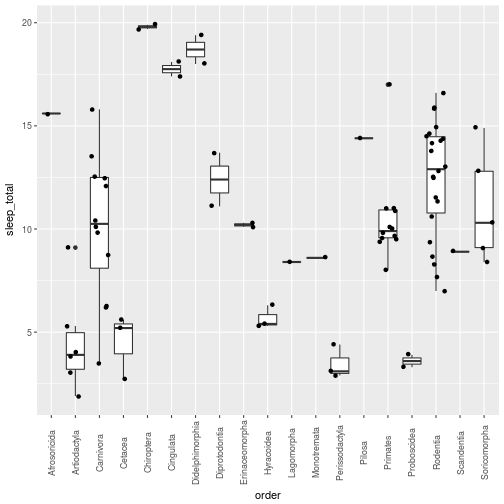
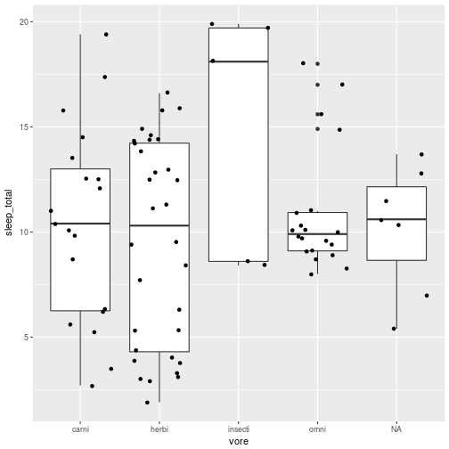
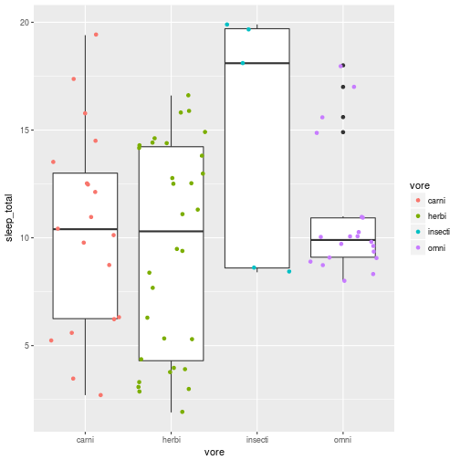
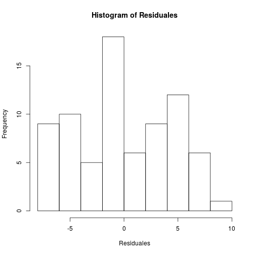
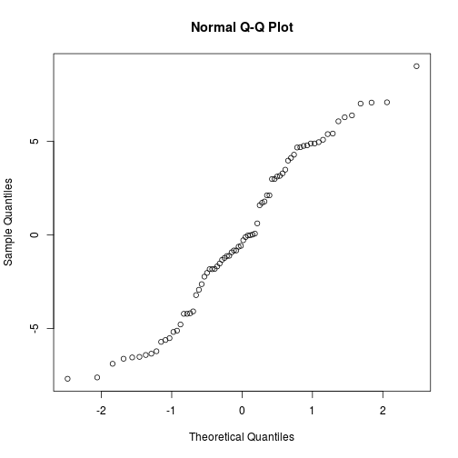
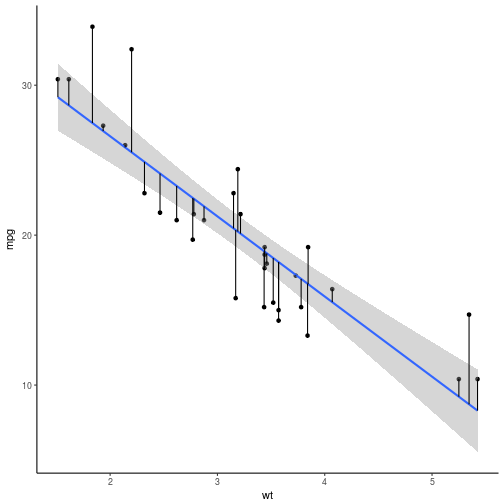
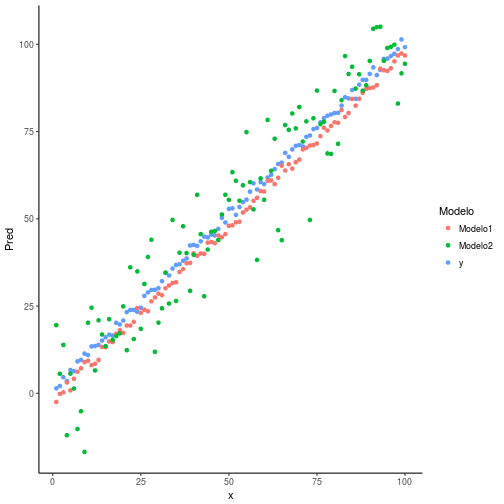

<style>
.reveal h1, .reveal h2, .reveal h3 {
  word-wrap: normal;
  -moz-hyphens: none;
}
</style>

<style>
.small-code pre code {
  font-size: 1em;
}
</style>

Supuestos de ANOVA y mínimos cuadrados
========================================================
author: Derek Corcoran
date: "21/03, 2018"
autosize: true
transition: rotate


Objetivos de este práctico
========================================================
incremental:true


- Entender los supuestos de un ANOVA de una via (independencia, aleatoreidad, homocedasticidad y normalidad)
- Entender el concepto de mínimos cuadrados
- Saber cuando realizar un ANOVA e interpretar sus resultados


Primer ejemplo sueño en mamíferos 
========================================================

- Base de datos de *R* msleep
- Para cargar usar *data(msleep)*
- ¿Duermen distinta cantidad de horas mamíferos de distintos ordenes?
- ¿Duermen distinta cantidad de horas mamíferos con distintas dietas?
- Generar gráficos exploratorios y test de ANOVA

Exploración visual
========================================================
class: small-code


```r
ggplot(msleep, aes(x = order, y = sleep_total)) + geom_boxplot() + geom_jitter() + theme(axis.text.x=element_text(angle=90, vjust=0.5))
```



Exploración visual
========================================================
class: small-code


```r
ggplot(msleep, aes(x = vore, y = sleep_total)) + geom_boxplot() + geom_jitter() 
```



¿Hay homogeneidad de varianza?
======================
class: small-code


```r
msleepclean <- msleep %>% filter(!is.na(vore))
bartlett.test(sleep_total ~ vore, data = msleepclean)
```



***


| statistic|  p.value| parameter|method                                    |
|---------:|--------:|---------:|:-----------------------------------------|
|  6.159716| 0.104093|         3|Bartlett test of homogeneity of variances |

Como determinar normalidad de los residuales
======================
class: small-code

¿Que es un residual?

$$Observado - Predicho$$

Tenemos que ajustar el modelo


```r
ANOVA.sleep <- aov(sleep_total ~ vore, data = msleepclean)
```

dos formas de extraer los residuales
======================
class: small-code


```r
Residuales <- ANOVA.sleep$residuals
library(broom)
Resultados <- augment(ANOVA.sleep)
```

***


```r
hist(Residuales)
hist(Resultados$.resid)
```



QQplot
======================
class: small-code

* Lo que queremos que pase en qqplot es que la linea sea recta y diagonal.


```r
qqnorm(Residuales)
qqnorm(Resultados$.resid)
```




* si esto es así asumimos distribucion normal.


Shapiro test
======================
class: small-code

* Forma mas sencilla de ver normalidad


```r
shapiro.test(Residuales)
shapiro.test(Resultados$.resid)
```


```

	Shapiro-Wilk normality test

data:  Residuales
W = 0.96123, p-value = 0.02035
```

Dado que valores son menores a 0.05, la distribución no es normal , se recomienda usar Kruskal-Wallis

Violación de normalidad
======================
class: small-code
Aumenta posibilidad de errores de tipo 1


```
            Df Sum Sq Mean Sq F value Pr(>F)  
vore         3  133.7   44.57   2.235 0.0914 .
Residuals   72 1435.7   19.94                 
---
Signif. codes:  0 '***' 0.001 '**' 0.01 '*' 0.05 '.' 0.1 ' ' 1
```

Segundo ejemplo suma errores cuadrados
========================================================

¿Que es el error? **¿Por qué al cuadrado??** Actividad shiny

$$Observado(puntos) - Predicho(linea)$$



Comparemos suma de errores vs suma errores cuadrados
========================================================

¿Que modelo predice mejor los valores de y el 1 o el 2?


Sumemos los errores
========================================================
class: small-code

```r
Simul$Error1 <- Simul$y - Simul$Modelo1
Simul$Error2 <- Simul$y - Simul$Modelo2
```


```r
sum(Simul$Error1)
```

```
[1] 316.4115
```

```r
sum(Simul$Error2)
```

```
[1] -20.30171
```

¿Que pasó?

Sumemos los errores Cuadrados
========================================================
class: small-code

```r
Simul$Error1 <- (Simul$y - Simul$Modelo1)^2
Simul$Error2 <- (Simul$y - Simul$Modelo2)^2
```


```r
sum(Simul$Error1)
```

```
[1] 1195.373
```

```r
sum(Simul$Error2)
```

```
[1] 9909.772
```


