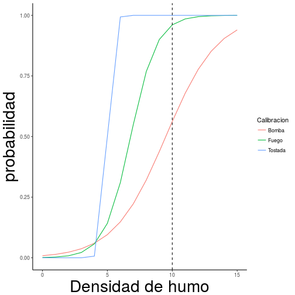
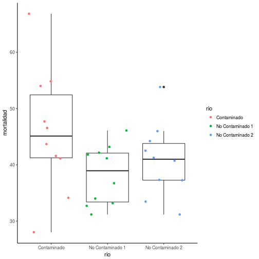

<style>
.reveal h1, .reveal h2, .reveal h3 {
  word-wrap: normal;
  -moz-hyphens: none;
}
</style>

<style>
.small-code pre code {
  font-size: 1em;
}
</style>

Análisis de poder
========================================================
author: Derek Corcoran
date: "28/03, 2018"
autosize: true
transition: rotate


El caso de la alarma de fuego
========================================================
incremental:true


* **Hipotesis nula**:
    + No hay fuego
* **Hipótesis alternativa**:
    + Hay fuego


Tipos de error (matriz de confución)
========================================================
incremental:true


|                |No hay fuego |Hay fuego    |
|:---------------|:------------|:------------|
|No suena alarma |No hay error |Error tipo 2 |
|Suena alarma    |Error tipo 1 |No hay error |

* Probabilidad de que suene la alarma cuando no hay fuego
    + $\alpha$ usualmente 5% 
    + una de cada 20 alarmas es falsa
    + ¿Cuál es el $\alpha$ de una alarma de auto?
* Probabilidad de que no suene la alarma cuando hay fuego
    + $\beta$ si es 10% uno de cada 10 fuegos no es detectado
    + poder es $1-\beta$ confianza de que fuegos son detectados

Effecto de beta
========================================================



Efecto de beta y alfa
========================================================
incremental:true
* ¿cual tiene mas probabilidad de sonar cuando no hay fuego?
    + $\alpha$ alto
* ¿Cuál tiene mas probabilidad de no sonar cuando hay fuego?
    + $\beta$ alto

***


¿Cuantos individuos (n)ecesitamos?
===================================
incremental:true
class: small-code


```r
dietsample <- read.csv("dietsample.csv")
```

* Caso dieta (previamente pesamos 5 individuos por dieta)
* Número de grupos
    + K = 3
* alpha
    + $\alpha$ = 0.05
* desviación estándar
    + *sd(broom::augment(aov(weightLoss ~ Diet, data = dietsample))$.resid)*
    + 2.84
* $\beta$ = 0.8 , ¿delta mínimo?

¿Cuantos individuos (n)ecesitamos?
===================================
incremental:true
class: small-code


```r
library(pwr2)
pwr.1way(k=3, n=15, alpha=0.05, delta=3, sigma=2.84)
```

```

     Balanced one-way analysis of variance power calculation 

              k = 3
              n = 15
          delta = 3
          sigma = 2.84
    effect.size = 0.4312482
      sig.level = 0.05
          power = 0.7051288

NOTE: n is number in each group, total sample = 45 power = 0.705128801287446
```

* ¿Que significa en este caso un poder de 0.8?
* ¿Que significa en esta caso un $\alpha$ de 0.05?
* Hagamos la tabla
* Shiny time

Aleatoridad reproducible
===================================
incremental:true
class: small-code


```r
x <- 1:10
x
```

```
 [1]  1  2  3  4  5  6  7  8  9 10
```


```r
sample(x, 3)
```

```
[1]  2 10  3
```

```r
sample(x, 3)
```

```
[1] 1 5 7
```

```r
sample(x, 3)
```

```
[1] 8 4 2
```

Aleatoridad reproducible
===================================
incremental:true
class: small-code


```r
set.seed(123)
sample(x, 3)
```

```
[1] 3 8 4
```

```r
set.seed(123)
sample(x, 3)
```

```
[1] 3 8 4
```

```r
set.seed(123)
sample(x, 3)
```

```
[1] 3 8 4
```


Muestremos de la base de datos
===================================
incremental:true
class: small-code


```r
diet <- read.csv("diet.csv")
set.seed(2018)
DietN19 <- diet %>% group_by(Diet) %>% sample_n(19)
summary(aov(weightLoss ~ Diet, data = DietN19))
```

```
            Df Sum Sq Mean Sq F value Pr(>F)  
Diet         2   52.0  25.991   4.176 0.0206 *
Residuals   54  336.1   6.224                 
---
Signif. codes:  0 '***' 0.001 '**' 0.01 '*' 0.05 '.' 0.1 ' ' 1
```


Tarea 1
=================
incremental:true
class: small-code

* En guía, ojala usando [rmarkdown](https://www.rstudio.com/wp-content/uploads/2016/03/rmarkdown-cheatsheet-2.0.pdf)
* Problema contaminación en ríos con pato corta corriente



***


|term      | df|   sumsq| meansq| statistic| p.value|
|:---------|--:|-------:|------:|---------:|-------:|
|rio       |  2|  301.25| 150.63|      2.36|    0.11|
|Residuals | 27| 1723.34|  63.83|        NA|      NA|


Shiny app en linea
===========

[Shiny](https://derek-corcoran.shinyapps.io/MinimosCuadrados/)

Prueba de Mann-Whitney en R
============

* Alternativa a t.test cuando no se cumplen los supuestos de normalidad
* Probaremos si hay diferencias en eficiencia de combustible con vehiculos de cambios automaticos o manuales


```

	Wilcoxon rank sum test with continuity correction

data:  mpg by am
W = 42, p-value = 0.001871
alternative hypothesis: true location shift is not equal to 0
```

