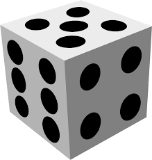
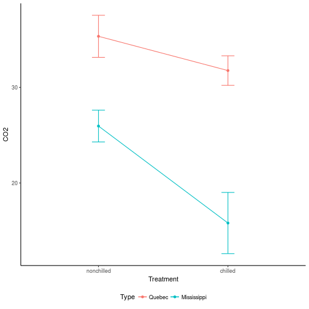
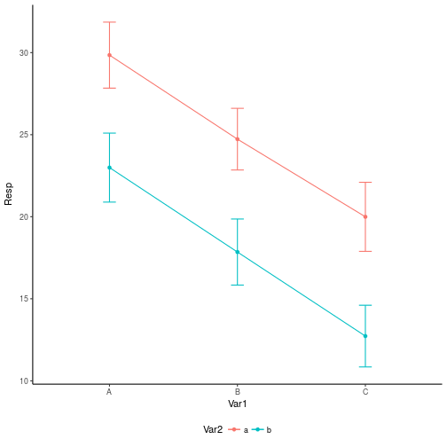

<style>
.reveal h1, .reveal h2, .reveal h3 {
  word-wrap: normal;
  -moz-hyphens: none;
}
</style>

<style>
.small-code pre code {
  font-size: 1em;
}
</style>

Comparaciones posthoc y diseños anidados
========================================================
author: Derek Corcoran
date: "11/04, 2018"
autosize: true
transition: rotate


=====

Volvamos a lo básico

Probabilidad de que algo ocurra
=========
incremental:true

Probabilidad de un 6


```r
p_dado6 <- 1/6
```

***



Probabilidad de que dos eventos ocurran
=========
incremental:true
class: small-code

* $p(A) \cap p(B) = p(A) * p(B)$
* ¿Cuál es la probabilidad de que al lanzar tres veces un dado, obtengamos 6 las tres veces? 


```r
p_dado6 <- 1/6
```


Probabilidad de que algo no ocurra
==========
incremental:true

$$p(6) + p(1,5) = 1$$


```r
p_dadoNo6 <- (1 - 1/6)
```

Probabilidad de que dos eventos no ocurran
=========
incremental:true

* Cual es la probabilidad que al lanzar cinco veces un dado, nunca obtengamos el valor de 6


```r
p_dadoNo6 <- (1 - 1/6)
```

Probabilidad de que algo ocurra al menos una vez
==========
incremental:true

* La probabilidad de que un evento $A$ no ocurra en $n$ intentos es:

$$(1-p(A))^n$$

* ¿Que es el complemento a esto?

$$1 - (1-p(A))^n$$

* Probabilidad de que algo ocurra al menos una vez


Probabilidad de que algo ocurra al menos una vez
==========
incremental:true

* Cual es la probabilidad de que al lanzar un dado cuatro veces al menos una vez obtengamos un valor de 6


```r
p_dado6 <- 1/6
```

¿Bonferroni?
======
incremental:true

* $\alpha = 0.05$ 
* $p = 0.05$
* Error tipo 1 = 95%

Considerando la ecuación 6, ¿cual es la probabilidad de que al hacer 6 comparaciones independientes podamos cometer un error de tipo 1?


```r
p_error <- 0.05
```

Correccion de Bonferroni y otras
======
incremental:true

* Bonferroni ajusta el valor de p para poder disminuir el alza de errores tipo 1 * Función `pairwise.t.test` con los argumentos:
* **x:** Vector de valores respuestas
* **g:** Vector de variable de agrupamiento para x
* **p.adjust.method:** El método a utilizar para ajustar el valor de p, las opciones son
    + "none"
    + "bonferroni"
    + "holm"
    + "hochberg"
    + "hommel"
    + "BH"
    + "BY"
    + "fdr"


Ejemplo
======
incremental:true
class: small-code


```r
summary(aov(Ozone ~ Month, data = airquality))
```

```
             Df Sum Sq Mean Sq F value Pr(>F)  
Month         1   3387    3387   3.171 0.0776 .
Residuals   114 121756    1068                 
---
Signif. codes:  0 '***' 0.001 '**' 0.01 '*' 0.05 '.' 0.1 ' ' 1
37 observations deleted due to missingness
```


```r
pairwise.t.test(x = airquality$Ozone, g = airquality$Month, p.adj = "none")
```

```

	Pairwise comparisons using t tests with pooled SD 

data:  airquality$Ozone and airquality$Month 

  5       6       7       8      
6 0.60877 -       -       -      
7 2.9e-05 0.01023 -       -      
8 1.9e-05 0.00831 0.91744 -      
9 0.32545 0.85838 0.00070 0.00048

P value adjustment method: none 
```

Recreo
=========

ANOVA de dos vias
==========
incremental:true

* Dos factores y su interacción



***

* ANOVA de dos vias, en el cual consideramos el efecto de cada variable de forma independiente y su interacción.

Interaccion
==============

* Variable 1 es la variable "principal" y la variable 2 es la variable anidada.



Ejemplo
========

```r
summary(aov(Resp ~ Var1 + Var2 + Var1:Var2, data = Varpar))
```

```
             Df Sum Sq Mean Sq F value Pr(>F)    
Var1          2 3037.2  1518.6 379.589 <2e-16 ***
Var2          1 2205.0  2205.0 551.168 <2e-16 ***
Var1:Var2     2    1.6     0.8   0.203  0.816    
Residuals   174  696.1     4.0                   
---
Signif. codes:  0 '***' 0.001 '**' 0.01 '*' 0.05 '.' 0.1 ' ' 1
```
