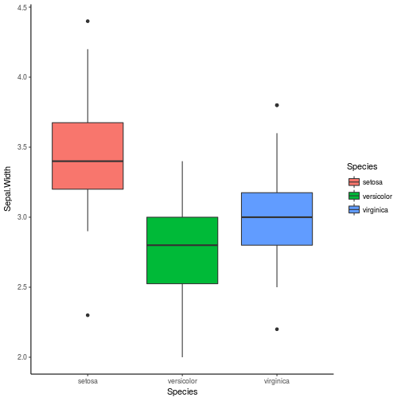
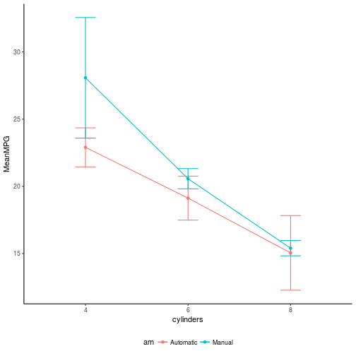

<style>
.reveal h1, .reveal h2, .reveal h3 {
  word-wrap: normal;
  -moz-hyphens: none;
}
</style>

<style>
.small-code pre code {
  font-size: 1em;
}
</style>

Como formular tu ANOVA
========================================================
author: Derek Corcoran
date: "18/04, 2018"
autosize: true
transition: rotate


ANOVA
==============
incremental:true
* Muchos ANOVA(s)
    + ANOVA
    + ANOVA factorial o en bloque
    + ANOVA anidado o jerarquico
    + ANOVA desbalanceado
    + al infinito
    
ANOVA simple
=================
incremental:true
class: small-code

* Varios grupos comparten una variable que creemos que es diferente entre grupos
    + por ejemplo ancho de sepalo puede ser differente entre tres especies de *Iris*
    

```r
data(iris)
IRISANOVA <- aov(Sepal.Width ~ Species, data = iris)
summary(IRISANOVA)
```

```
             Df Sum Sq Mean Sq F value Pr(>F)    
Species       2  11.35   5.672   49.16 <2e-16 ***
Residuals   147  16.96   0.115                   
---
Signif. codes:  0 '***' 0.001 '**' 0.01 '*' 0.05 '.' 0.1 ' ' 1
```

ANOVA simple
=================
incremental:true
class: small-code




ANOVA factorial
===============
incremental:true
class: small-code

* Más de un factor puede afectar nuestra variable respuesta
* Además interacciones
* Ejemplo: Economía de combustible en mtcars según si es automático o manual y el número de cilindros que tiene


```r
ANOVA.AUTO <- aov(mpg ~ am + cyl + am:cyl, data = mt)
summary(ANOVA.AUTO)
```

```
            Df Sum Sq Mean Sq F value   Pr(>F)    
am           1  405.2   405.2  46.892 1.93e-07 ***
cyl          1  449.5   449.5  52.029 7.50e-08 ***
am:cyl       1   29.4    29.4   3.407   0.0755 .  
Residuals   28  241.9     8.6                     
---
Signif. codes:  0 '***' 0.001 '**' 0.01 '*' 0.05 '.' 0.1 ' ' 1
```


ANOVA factorial
===============


***



ANOVA anidado o jerarquico
===============
incremental:true
class: small-code

* Tenemos un factor jerarquicamente dentro de otro 
  + individuos dentro de una especie)
  + hojas dentro de un árbol
  + varias medidas dentro de un mismo individuo
  + en anova si el factor B esta anidado dendtro de A tenemos `A/B`
* Ejemplo individuos en la base de datos CO2


```r
ANOVAUptake <- aov(uptake  ~  Type + Treatment + Type:Treatment + Type/Plant, data=CO2)
summary(ANOVAUptake)
```

```
               Df Sum Sq Mean Sq F value   Pr(>F)    
Type            1   3366    3366  50.017 8.13e-10 ***
Treatment       1    988     988  14.685 0.000269 ***
Type:Treatment  1    226     226   3.355 0.071152 .  
Type:Plant      8    283      35   0.525 0.833637    
Residuals      72   4845      67                     
---
Signif. codes:  0 '***' 0.001 '**' 0.01 '*' 0.05 '.' 0.1 ' ' 1
```

Variables fijas vs aleatoreas
================
incremental:true
class: small-code

* **Variables fijas:** Se espera que tengan una influencia predecible y sistemática en sobre lo que queremos explicar. Además usan todos los niveles de un factor (Ejemplo genero)
    + Uso en `R`: A + B
* **Variables aleatoreas:** Se espera que su influencia sea impredecible e idiosincratica. Además no se usan todos los niveles de un factor (todos los individuos) A + Error(B)

Variables fijas vs aleatoreas
================
incremental:true
class: small-code


```r
ANOVAUptake <- aov(uptake  ~  Type + Treatment + Type:Treatment + Error(Type/Plant), data=CO2)
summary(ANOVAUptake)
```

```

Error: Type
     Df Sum Sq Mean Sq
Type  1   3366    3366

Error: Type:Plant
               Df Sum Sq Mean Sq F value  Pr(>F)    
Treatment       1  988.1   988.1  27.949 0.00074 ***
Type:Treatment  1  225.7   225.7   6.385 0.03543 *  
Residuals       8  282.8    35.4                    
---
Signif. codes:  0 '***' 0.001 '**' 0.01 '*' 0.05 '.' 0.1 ' ' 1

Error: Within
          Df Sum Sq Mean Sq F value Pr(>F)
Residuals 72   4845   67.29               
```


Más casos y resumen
=========================
incremental:true
class: small-code

* Caso hipotético $Y$ es la variable a explicar y todo el resto variables explicativas en la base de datos d
* ANOVA Simple

```r
aov(Y ~ A + B, data=d)
```
* para agregar interacciones


```r
aov(Y ~ A + B + A:B, data=d)
```
Igual a


```r
aov(Y ~ A * B, data=d)
```

Anovas anidados y variables aleatorias
=======
incremental:true
class: small-code

* B anidado en A


```r
aov(Y ~ A/B, data=d)
```

* A es una variable aleatoria pero B esta anidada en A


```r
aov(Y ~ B + Error(A/B), data=d)
```


* B y X interactuan dentro de niveles aleatorios de A


```r
aov(Y ~ (B*X) + Error(A/(B*X)), data=d)
```

y ahora a proba en Kahoot
==========

[https://kahoot.it/](https://kahoot.it/)
